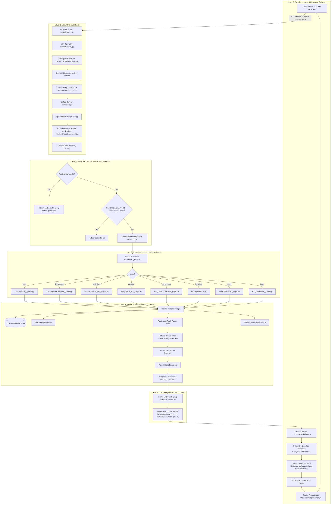

# 🧠 AGENTIC RAG — Comprehensive Architecture & Reverse Engineering Deep Dive

> **Document Type**: Master Technical Architecture & Runtime Execution Reference  
> **Repository**: `Agentic_RAG`  
> **Last reviewed against source**: 2026-08-19  
> **Core Frameworks**: LangChain Core/Community, LangGraph, FastAPI, ChromaDB, OpenAI, Groq, NVIDIA NeMo Reranker, Redis, React + Vite, Prometheus, Grafana.  
> **Supported Operational Modes**: `baseline` (Phase 1), `router` (Phase 2), `crag` (Phase 3), `decompose` (Phase 4), `multi_hop` (Phase 5), `tools` (Phase 6), `agentic` (Phase 7), `consensus` (Phase 8).  
> **Cross-cutting phases**: Phase 8 production API, Phase 8.5 hardening, Phase 9 streaming/cache/metrics, Phase 10 semantic cache & RBAC, Phase 11 multimodal & compression, Phase 12 async ingest & webhooks.

---

## Table of Contents

1. [Executive Overview](#section-1--executive-overview)
2. [Complete Project Structure](#section-2--complete-project-structure)
3. [Logical Architecture](#section-3--logical-architecture--component-interaction)
4. [End-to-End Query Execution Trace](#section-4--end-to-end-query-execution-trace)
5. [Code-Level Execution Trace Table](#section-5--code-level-execution-trace-table)
6. [Capability Matrix](#section-6--agentic-rag-deep-dive--capability-matrix)
7. [Agents In-Depth](#section-7--agents-in-depth)
8. [Orchestration & LangGraph Workflows](#section-8--orchestration--langgraph-workflows)
9. [State Management](#section-9--state-management)
10. [RAG Pipeline & Ingestion](#section-10--rag-pipeline--ingestion-architecture)
11. [Retrieval & Context Compression](#section-11--retrieval--context-compression-deep-dive)
12. [Tool Registry](#section-12--tool-registry)
13. [Prompt Catalog](#section-13--prompt-catalog)
14. [LLM Interactions & Resilience](#section-14--llm-interactions--resilience)
15. [Conversation Memory](#section-15--conversation-memory--persistence)
16. [Guardrails & Security](#section-16--guardrails--security-specifications)
17. [Error Handling & Circuit Breakers](#section-17--error-handling--circuit-breakers)
18. [Configuration Catalog](#section-18--configuration--environment-catalog)
19. [Async Ingestion Queue](#section-19--asynchronous-ingestion-queue--webhooks)
20. [Testing & Verification](#section-20--testing--verification-summary)
21. [HTTP API Surface](#section-23--http-api-surface--contracts)
22. [SSE Streaming Protocol](#section-24--sse-streaming-protocol)
23. [Frontend Architecture](#section-25--frontend-architecture)
24. [Domain Schemas](#section-26--domain-schemas)
25. [Observability](#section-27--observability-metrics--tracing)
26. [Evaluation Suite](#section-28--evaluation-suite)
27. [Production, Docker & CI](#section-29--production-docker--ci)
28. [CLI, Streamlit & Clients](#section-30--cli-streamlit--clients)
29. [HTTP Status & Error Mapping](#section-31--http-status--error-mapping)
30. [Study & Interview Guide](#section-21--file-by-file-study--interview-guide)
31. [Glossary](#section-22--glossary)

---

# SECTION 1 — EXECUTIVE OVERVIEW

### 1.1 What This Project Does
This project is an enterprise-grade, multi-strategy **Agentic Retrieval-Augmented Generation (Agentic RAG)** research assistant. It accepts natural language queries, analyzes their complexity and intent, dynamically selects and executes adaptive retrieval and reasoning strategies, verifies source document relevance, corrects failed retrieval attempts, extracts tabular matrices and multimodal figures, executes AST-safe tool computations, enforces multi-tenant Role-Based Access Control (RBAC), and sanitizes inputs and outputs against jailbreaks, prompt injections, and PII/PHI leakage.

### 1.2 The Problem It Solves
Traditional RAG operates as a static, linear pipeline:
$$\text{Query} \longrightarrow \text{Embedding} \longrightarrow \text{Vector Top-}K \longrightarrow \text{Prompt Stuffing} \longrightarrow \text{LLM Output}$$
This approach fails in real-world production environments because:
1. **Inefficient Retrieval**: Queries like *"Hello"* or *"What is 2+2?"* needlessly execute expensive vector searches.
2. **Retrieval Blindspots & Confabulation**: When the vector store returns low-relevance chunks, the LLM hallucinates rather than acknowledging information gaps.
3. **Multi-Hop & Comparative Blindspots**: Queries comparing multiple concepts (e.g. *"Compare CRAG vs Self-RAG"*) or requiring sequential dependency resolution (e.g. *"Who founded the company that built model X and what is their newest project?"*) cannot be resolved in a single retrieval pass.
4. **Context Window Pollution**: Stuffing irrelevant, redundant tokens inflates LLM inference cost and degrades attention across long passages ("lost in the middle").
5. **Security & Compliance Vulnerabilities**: Direct/indirect prompt injections, data leakage across multi-tenant boundaries, and unredacted PII/PHI represent severe enterprise risks.

### 1.3 Why This Is Agentic RAG
This system elevates retrieval from a static pipeline to a set of **agent-callable tools, dynamic feedback loops, and graph-governed decision states**:
- **Autonomous Intent Routing**: Distinguishes direct chit-chat, vector retrieval, and web search (`direct` | `retrieve` | `web_search`).
- **Strategy Orchestration (agentic mode)**: After routing, a second LLM picks `decompose` | `multi_hop` | `tools` | `simple`, then every retrieval path is CRAG-graded.
- **Self-Correction & Reflection (CRAG)**: An LLM grades each chunk with a 0–1 score. Chunks below `GRADER_RELEVANCE_THRESHOLD` (default 0.5) are dropped; empty pools trigger rewrite (up to `MAX_RETRIEVAL_RETRIES`) then web fallback.
- **Query Decomposition**: Deconstructs complex inquiries into 1–5 parallel sub-queries (`langgraph.types.Send` map-reduce) and synthesizes the merged context.
- **Iterative Multi-Hop Reasoning**: Sequential hops capped at `MAX_MULTI_HOP_STEPS` (default 3); each hop query is conditioned on prior findings.
- **Tool Calling**: Bound tools `retrieve_docs`, `web_search`, `calculator` with node-gate quarantine of `[TOOL_ERROR]` / `[TOOL_EMPTY]` / `[CIRCUIT_OPEN]` results (abort after 3 quarantines).
- **Dynamic Context Compression**: Sentence-level scoring keeps the top `CONTEXT_COMPRESSION_RATIO` (default 0.65) of sentences — typically 30–50% token savings; markdown tables are never pruned.
- **Multi-Agent Adversarial Debate**: A 3-agent jury (Proposer $\to$ Challenger Critic $\to$ Consensus Judge) outputs a parsed confidence score (0.0–1.0).
- **Egress Completeness**: Every successful run attaches citations (chunk id, page, section, snippet, score) and exactly 3 grounded follow-up questions.

### 1.4 Simplified Mental Model & Runtime Architecture

```
                                      ┌────────────────────────┐
                                      │   User Query (Client)  │
                                      └───────────┬────────────┘
                                                  │ HTTP / SSE / CLI
                                                  ▼
                                      ┌────────────────────────┐
                                      │  FastAPI / Rate Limiter│
                                      └───────────┬────────────┘
                                                  │
                                                  ▼
                        ┌──────────────────────────────────────────────────┐
                        │              Unified Runner Chokepoint           │
                        │         (`src.runner::run_agent / stream`)       │
                        │                                                  │
                        │ 1. Input PII/PHI (redact | block | off)          │
                        │ 2. InputGuardrails: length, credentials,         │
                        │    InjectionDetector.scan_input()                │
                        │ 3. Memory packing (if chat_history present)      │
                        │ 4. Exact Redis cache then semantic cosine cache  │
                        │    (both gated by CACHE_ENABLED; skipped when    │
                        │    conversation history would change the answer) │
                        │ 5. Process-wide query/token budget (cache miss)  │
                        └─────────────────────────┬────────────────────────┘
                                                  │ Cache Miss / Valid
                                                  ▼
                        ┌──────────────────────────────────────────────────┐
                        │          Agent Orchestrator / StateGraph         │
                        │        (`src.graph.*` compiled LangGraph)        │
                        │                                                  │
                        │  ┌───────────────┐  ┌──────────────┐             │
                        │  │ Router / Plan │  │ CRAG Grading │             │
                        │  └───────┬───────┘  └──────┬───────┘             │
                        │          │                 │ (Low Score)         │
                        │          ▼                 ▼                     │
                        │  ┌───────────────┐  ┌──────────────┐             │
                        │  │ Decompose /   │  │ Query Rewrite│             │
                        │  │ Multi-Hop     │  │ / Web Search │             │
                        │  └───────┬───────┘  └──────┬───────┘             │
                        │          │                 │                     │
                        │          ▼                 ▼                     │
                        │  ┌─────────────────────────────────┐             │
                        │  │ Hybrid Retrieval + Reranking    │             │
                        │  │ + Document RBAC + Compression   │             │
                        │  └─────────────────┬───────────────┘             │
                        │                    │                             │
                        │                    ▼                             │
                        │  ┌─────────────────────────────────┐             │
                        │  │ Generation / Multi-Agent Debate │             │
                        │  └─────────────────────────────────┘             │
                        └─────────────────────────┬────────────────────────┘
                                                  │
                                                  ▼
                        ┌──────────────────────────────────────────────────┐
                        │             Post-Execution Guardrails            │
                        │                                                  │
                        │ 1. Node Output Gates (abort → error_code)        │
                        │ 2. Citation extraction (build_response)          │
                        │ 3. OutputGuardrails + scan_output leakage check  │
                        │ 4. Output PII/PHI sanitization                   │
                        │ 5. Optional LLM-as-judge quality gate (off)      │
                        │ 6. Follow-up generation (exactly 3 questions)    │
                        │ 7. Cache write + Prometheus token/cost counters  │
                        └─────────────────────────┬────────────────────────┘
                                                  │
                                                  ▼
                                      ┌────────────────────────┐
                                      │ Final Response Payload │
                                      └────────────────────────┘
```

---

# SECTION 2 — COMPLETE PROJECT STRUCTURE

```
Agentic_RAG/
├── .github/
│   ├── workflows/
│   │   ├── ci.yml                 # lint, pytest+cov, golden offline, pip-audit, gitleaks, frontend, docker/trivy
│   │   └── nightly-eval.yml       # ingest + live HitRate@K / MRR against golden_qa.json
│   └── dependabot.yml
├── .pre-commit-config.yaml        # ruff + local pytest hook
├── data/
│   ├── sample_docs/               # Source document corpora (rag.pdf)
│   ├── eval/golden_qa.json        # Golden Q&A pairs (CI offline schema gate + nightly retrieval)
│   ├── chroma_db/                 # Persistent local Chroma (compose uses HTTP server instead)
│   ├── parent_store.json          # Parent section context store
│   └── flashrank_cache/           # Optional local FlashRank ONNX cache
├── docs/
│   ├── CONCEPTS.md                # Conceptual deep dive (RAG vs Agentic RAG)
│   ├── GUARDRAILS.md              # Input/output security and rate/cost control specs
│   ├── LANGCHAIN_STACK.md         # LangChain & LangGraph component mapping
│   ├── LANGSMITH_SETUP.md         # LangSmith setup and environment guide
│   ├── LANGSMITH_TRACING.md       # Tracing integration guide
│   ├── PRIVACY_COMPLIANCE.md      # PII/PHI detection and redaction policy specifications
│   ├── PRODUCTION.md              # Enterprise deployment, Docker, monitoring, scaling
│   ├── QUICK_START.md             # 5-minute setup and CLI guide
│   ├── ROADMAP.md                 # Phase-by-phase implementation history (0–12, 15)
│   ├── BACKEND_END_TO_END_GUIDE.pdf / .html
│   └── archive/                   # Historical point-in-time build reports
├── frontend/                      # React 18 + Vite + TypeScript (primary UI)
│   ├── src/
│   │   ├── api/client.ts          # REST + SSE client (health, modes, query, ingest)
│   │   ├── components/            # Sidebar, ChatHistory, ChatInput, ChatMessage, TracePanel,
│   │   │                          # FollowUps, Thinking, EmptyState
│   │   ├── data/modes.ts          # Catalog of the 8 operational modes + examples
│   │   ├── hooks/useChat.ts       # SSE streaming state + IndexedDB persistence
│   │   ├── lib/chatStore.ts       # localStorage/IndexedDB chat store
│   │   ├── types.ts               # AgentMode, QueryResponse, IngestJob, Citation, ...
│   │   ├── App.tsx & App.css
│   │   └── main.tsx
│   ├── package.json
│   └── vite.config.ts             # Dev proxy `/api` → `:8000`; injects API_KEY server-side
├── monitoring/
│   ├── prometheus.yml
│   └── grafana/                   # Pre-provisioned dashboards and datasources
├── src/
│   ├── bootstrap.py               # MUST import first — LangSmith env before LangChain
│   ├── cli.py                     # `python -m src.cli ask "..." --mode ... [-v]`
│   ├── config.py                  # pydantic-settings Settings (see Section 18)
│   ├── guardrails.py              # Input/Output/Quality/CostTracker/RateLimitError
│   ├── llm.py                     # ChatOpenAI + optional ChatGroq with_fallbacks
│   ├── logging_config.py          # JSON logs in production, console in development; X-Request-ID
│   ├── observability.py           # LangSmith init + tracing status
│   ├── privacy.py                 # Context-aware PII/PHI (Luhn, labelled IDs, clinical PHI)
│   ├── prompts.py                 # ChatPromptTemplate catalog (see Section 13)
│   ├── runner.py                  # Master chokepoint: run_agent / stream_agent / _dispatch
│   ├── schemas.py                 # AgentResponse, Citation, RBACContext
│   ├── streaming.py               # ContextVar emitter: step/token; CancelledRun on disconnect
│   ├── agents/
│   │   ├── decomposer.py          # DecompositionResult (1–5 sub_queries)
│   │   ├── followups.py           # Exactly 3 grounded follow-ups
│   │   ├── grader.py              # Per-chunk DocumentGrade + threshold filter
│   │   ├── multi_hop.py           # analyze_chain + reflect_chain
│   │   ├── orchestrator.py        # STRATEGY_PROMPT → StrategyChoice
│   │   ├── query_rewriter.py      # RewrittenQuery structured output
│   │   └── router.py              # RouteDecision (direct | retrieve | web_search)
│   ├── api/
│   │   ├── health.py              # Chroma, Redis, OpenAI, Groq, NVIDIA, data dir probes
│   │   ├── metrics.py             # Prometheus counters/histograms
│   │   ├── rate_limit.py          # Sliding-window per API key / IP (Redis or memory)
│   │   ├── security.py            # Constant-time X-API-Key; metrics/readiness gates
│   │   └── server.py              # FastAPI app (see Section 23)
│   ├── cache/
│   │   ├── redis_cache.py         # Exact answer cache + Idempotency-Key store
│   │   └── semantic_cache.py      # In-process cosine cache (tenant + roles isolated)
│   ├── chains/generation.py       # rag_chain, direct_chain, web_search_chain, synthesis_chain
│   ├── evaluation/
│   │   ├── evaluate_all_modes.py  # LLM-as-judge harness across modes
│   │   ├── metrics.py             # Faithfulness / relevance / context precision
│   │   ├── retrieval_metrics.py   # HitRate@K, MRR, offline golden schema gate
│   │   └── run_eval.py
│   ├── graph/
│   │   ├── agent_graph.py         # Mode 7: router → strategy → subgraph → CRAG loop
│   │   ├── consensus_graph.py     # Mode 8: retrieve → propose → challenge → adjudicate | abstain
│   │   ├── crag_graph.py          # Mode 3: retrieve → grade → generate | rewrite | fallback
│   │   ├── decompose_graph.py     # Mode 4: Send map-reduce
│   │   ├── multi_hop_graph.py     # Mode 5: analyze → hop → reflect loop
│   │   ├── router_graph.py        # Mode 2: classify → direct | retrieve | web
│   │   └── tools_graph.py         # Mode 6: bind_tools loop (max 10 iterations)
│   ├── ingestion/
│   │   ├── chunking.py            # TOC / heading / fixed parent–child
│   │   ├── cleanse.py             # Headers, footers, hyphenation, boilerplate
│   │   ├── ingest.py              # CLI ingest + Chroma client (persistent | http)
│   │   ├── multimodal.py          # Figure/diagram chunks (chunk_type=figure)
│   │   ├── parent_store.py        # JSON parent expansion
│   │   ├── queue.py               # Background ThreadPool + HMAC webhooks
│   │   └── tables.py              # PyMuPDF tables → GitHub-flavored markdown
│   ├── memory/
│   │   ├── chat_memory.py         # Compact packing (recent Q+A, older Q-only)
│   │   └── supabase_store.py      # chat_messages + RLS
│   ├── rag/baseline.py            # Mode 1: retrieve → format_docs → rag_chain
│   ├── resilience/
│   │   ├── circuit_breaker.py     # CLOSED → OPEN (threshold=5) → HALF-OPEN (60s)
│   │   └── node_gate.py           # Deterministic contract checks (no LLM)
│   ├── security/injection.py      # scan_input / scan_context / scan_output
│   ├── retrieval/
│   │   ├── retriever.py           # Hybrid/MMR/similarity + RRF + RBAC + parent expand
│   │   ├── reranker.py            # NVIDIA NeMo or local FlashRank
│   │   ├── compression.py         # Sentence scoring; tables kept intact
│   │   └── citations.py           # build_response / docs_to_citations / docs_to_sources
│   └── tools/
│       ├── all_tools.py           # retrieve_docs, web_search, calculator (AST-safe)
│       └── web_search.py          # Re-export of all_tools.web_search
├── tests/                         # Pytest suite (see Section 20)
│   ├── load/locustfile.py         # Load profile: 429/503/504/p95
│   └── conftest.py
├── deploy.sh
├── docker-compose.yml             # redis, chroma, api, frontend, prometheus, grafana
├── Dockerfile                     # Multi-stage, non-root, no compiler in runtime
├── pyproject.toml
├── requirements.txt / requirements-dev.txt
├── SECURITY.md / CONTRIBUTING.md
├── streamlit_app.py               # In-process legacy UI (calls run_agent directly)
└── AGENTIC_RAG_DEEP_DIVE.md       # This document
```

### Component Responsibility Matrix

| Path | Responsibility | Used at Runtime? | Key Components | Dependencies |
|---|---|---|---|---|
| `src/config.py` | Central configuration & validation | Yes (Always) | `Settings`, `is_production()` | `pydantic-settings` |
| `src/bootstrap.py` | LangSmith env before LangChain imports | Yes (API/CLI/Streamlit) | `init_langsmith_tracing()` | `src.observability` |
| `src/runner.py` | Chokepoint: privacy, guardrails, cache, dispatch, follow-ups | Yes (Always) | `run_agent()`, `stream_agent()`, `_dispatch()` | graphs, cache, privacy, guardrails |
| `src/guardrails.py` | Length, credentials, injection, output, budget | Yes (Always) | `InputGuardrails`, `OutputGuardrails`, `CostTracker`, `QualityGuardrails` | `injection.py`, `metrics.py` |
| `src/security/injection.py` | Jailbreak / injection / exfil scans | Yes (via guardrails + node_gate) | `InjectionDetector.scan_input/context/output` | `re`, `base64` |
| `src/cache/redis_cache.py` | Exact cache + idempotency; calls semantic cache | Yes if `CACHE_ENABLED` | `get_cached_response()`, `set_idempotent_response()` | `redis` |
| `src/cache/semantic_cache.py` | Cosine similarity ≥ 0.94 | Yes if cache + semantic flags | `SemanticCache.lookup/store` | OpenAI embeddings |
| `src/retrieval/retriever.py` | Hybrid + RBAC + parent expand | Yes (Retrieval) | `retrieve()`, `format_docs()`, `_filter_rbac()` | Chroma, BM25, reranker |
| `src/retrieval/reranker.py` | Cross-encoder rescoring | Yes if `RERANK_ENABLED` | `rerank_documents()` | NVIDIA / FlashRank |
| `src/retrieval/compression.py` | Sentence pruning (ratio 0.65) | Yes if enabled, via `format_docs` | `compress_documents()`, `_score_sentence()` | `re`, `math` |
| `src/retrieval/citations.py` | Provenance assembly | Yes (every mode) | `build_response()`, `docs_to_citations()` | `src.schemas` |
| `src/graph/agent_graph.py` | Full orchestrator | Mode `agentic` | `build_full_agent_graph()`, `ask_agentic()` | subgraphs + grader |
| `src/graph/consensus_graph.py` | 3-agent debate + abstain/overlap filter | Mode `consensus` | `ask_consensus()` | prompts, retrieve |
| `src/ingestion/queue.py` | Async ingest + webhooks | Ingest API | `IngestionQueue`, HMAC `sha256=` | `ThreadPoolExecutor` |
| `src/api/server.py` | HTTP/SSE | Yes (HTTP) | `/query`, `/query/stream`, `/ingest/jobs`, `/health` | FastAPI |
| `src/streaming.py` | Progressive events | SSE path | `use_emitter`, `CancelledRun` | `ContextVar` |
| `src/resilience/node_gate.py` | Deterministic node contracts | Graphs (crag/tools/agentic) | `check_tool_result`, `check_answer`, `check_route` | injection scanner |
| `src/llm.py` | LLM factory + Groq fallback | Yes (LLM calls) | `get_llm()`, `get_structured_llm()` | OpenAI, Groq |
| `src/privacy.py` | PII/PHI | Yes (Always) | `PrivacyGuard.apply_input/output` | Luhn + labelled regex |

---

# SECTION 3 — LOGICAL ARCHITECTURE & COMPONENT INTERACTION



---

# SECTION 4 — END-TO-END QUERY EXECUTION TRACE

Let us trace a realistic, highly demanding query through the complete system:
$$\mathbf{Q}: \text{"Compare the performance trade-offs of CRAG and Self-RAG, and calculate 25 * 40."}$$
Executed in mode: `mode = "agentic"`, `tenant_id = "research_team"`, `user_roles = ["researcher"]`.

```
====================================================================================================
STAGE 1: HTTP INGESTION & TRANSPORT DECODING
====================================================================================================
1. Client POSTs JSON to `/query` (or `/query/stream`):
   Payload: {
     "question": "Compare the performance trade-offs of CRAG and Self-RAG, and calculate 25 * 40.",
     "mode": "agentic",
     "tenant_id": "research_team",
     "user_roles": ["researcher"],
     "session_id": "session_abc123",
     "use_memory": true,
     "chat_history": []
   }
   Optional header: Idempotency-Key (TTL IDEMPOTENCY_TTL_SECONDS=86400). Reuse with a
   different body → HTTP 409.
2. File: `src/api/server.py` → `query()`
   - Pydantic: question 1–2000 chars; session_id `^[A-Za-z0-9_-]+$` length 8–64;
     chat_history max 20 turns; user_roles default ["public"].
   - `RequestIdMiddleware` binds `X-Request-ID` into logging ContextVar.
3. `src/api/security.py` → `verify_api_key()`
   - Production ALWAYS requires auth. Constant-time `secrets.compare_digest`.
   - Missing/invalid → 401. API_KEY unset while auth required → 503.
4. `src/api/rate_limit.py` → `enforce_client_rate_limit()`
   - Sliding 60s window, key = API key else client IP (X-Forwarded-For only if TRUST_PROXY_HEADERS).
   - Default 20 req/min/client. Exceed → 429 + Retry-After: 60.
5. `_concurrency_slot()` acquires 1 of `max_concurrent_queries` (default 8).
   Wait > `concurrency_acquire_timeout_seconds` (5s) → 503 + Retry-After: 5.
6. `_run_agent_with_timeout` runs `run_agent` in a thread pool, wall clock
   `request_timeout_seconds` (120s) → 504. SSE uses a separate `stream_timeout_seconds` (300s)
   plus a per-event gap of `request_timeout_seconds`.

====================================================================================================
STAGE 2: PRE-FLIGHT (src/runner._prepare_agent_run) — ORDER MATTERS
====================================================================================================
7. Privacy FIRST: `PrivacyGuard.apply_input()`
   - Modes: off | redact | block (PRIVACY_INPUT_MODE, default redact).
   - PHI only if PRIVACY_DETECT_PHI=true. Block → ValueError → HTTP 400.
8. InputGuardrails.validate(sanitized):
   - Length 3–3000 chars, ≤500 words (API already capped at 2000).
   - Credential regex: sk-*, AKIA*, gh[pousr]_*, PEM, password=/api_key=/Bearer.
   - Then `InjectionDetector.scan_input()` (if INJECTION_GUARDRAILS_ENABLED).
     Modes: block (error) | warn | off. Educational "what is a jailbreak?" is whitelisted.
     Findings increment `rag_injection_attempts_total`.
9. Cacheability: `should_use_cache()` is False unless CACHE_ENABLED, and False when
   use_memory AND chat_history is non-empty (history would change the answer).
10. Memory: if use_memory and chat_history, `augment_question_with_history()` packs
    3 recent Q + truncated A (500 chars) and up to 10 older questions-only.
    Cache is keyed on the *sanitized* question (no history), so history never poisons keys.
11. Budget is NOT consumed yet — cache hits are free.

====================================================================================================
STAGE 3: MULTI-TIER CACHE LOOKUP (only if CACHE_ENABLED)
====================================================================================================
12. `redis_cache.get_cached_response(sanitized_q, mode, rbac)`
    Key: `rag:v1:{mode}:{tenant}:{sha256(norm_q:tenant:roles)}`.
    Exact hit → output guardrails still run; SSE replays steps then answer.
13. On miss, `SemanticCache.lookup()` embeds via OpenAIEmbeddings, cosine vs
    in-process entries isolated by tenant_id + roles_key. Threshold 0.94, max 1000 entries.
    Miss → `_consume_budget()`: process-wide queries/min (60) and tokens/hour (100000).

====================================================================================================
STAGE 4: AGENTIC STATEGRAPH — classify THEN strategy (not strategy first)
====================================================================================================
14. `_dispatch` → `ask_agentic()` initializes AgentState including
    route, strategy, retry_count=0, abort=False (see Section 9).
15. Node `classify` (`router_chain`): mixed comparison + math → route=`retrieve`
    (knowledge-base question; calculator is a later strategy concern).
    `check_route()` must be in {direct, retrieve, web_search} else abort.
16. Conditional `route_condition`: retrieve → `strategy` node.
    (direct would skip retrieval; web_search would call DuckDuckGo and END.)
17. Node `strategy` (`choose_strategy` / STRATEGY_PROMPT): strategy=`tools`,
    reasoning mentions arithmetic + comparative retrieval.
    `check_strategy()` must be in {decompose, multi_hop, tools, simple}.
18. `strategy_condition` → `tools` node, which invokes the tools subgraph with
    skip_router=True and route forced to retrieve. Token emission is suppressed
    (`suppress_token_emit`) because agentic will re-generate after grading.

====================================================================================================
STAGE 5: TOOLS SUBGRAPH + HYBRID RETRIEVAL
====================================================================================================
19. `tools_agent_node` binds TOOLS, loops up to 10 iterations:
    LLM emits tool_calls, e.g.:
      a) calculator(expression="25 * 40")  → AST-safe eval → "1000"
      b) retrieve_docs(query="CRAG vs Self-RAG trade-offs")
    Each result passes `check_tool_result()`. Empty/error/circuit-open → quarantine
    (not used as evidence). 3 quarantines → abort with error_code=node_gate_abort.
20. `retrieve()` pipeline:
    i.   Dense: Chroma over-fetch candidate_k=20 (×2 if rbac_context is not None).
    ii.  Sparse: BM25 rebuilt when collection count changes (thread lock).
    iii. RRF: score(d) = Σ 1/(rrf_k + rank + 1) with rrf_k=60.
    iv.  `_filter_rbac(docs, ctx)` — graphs currently call retrieve(query) without
         passing the request RBACContext, so the default ctx is tenant=default,
         roles=["public"]. Request tenant_id/user_roles still isolate cache keys
         and stamp AgentResponse.tenant_id.
    v.   Rerank: NVIDIA NeMo (circuit-breaker protected) or FlashRank → pool then top_k=6.
    vi.  Parent expansion from data/parent_store.json (PARENT_MAX_CHARS=3500).
    vii. `format_docs(docs, query=...)` optionally `compress_documents` (keep 65% of
         sentences by query overlap + entity density + position + table bonus).
21. Tools subgraph returns documents + a draft answer. Agentic then ALWAYS grades.

====================================================================================================
STAGE 6: CRAG SAFETY NET, GENERATION, EGRESS
====================================================================================================
22. `grade_node`: grader_chain → GradingResult with per-chunk {chunk_index, relevant,
    score∈[0,1], reason}. Keep chunks where relevant AND score ≥ 0.5.
    Empty filtered set + retry_count < MAX_RETRIEVAL_RETRIES → rewrite_node → grade again.
    Else fallback_node (web search), unless strategy=tools already has a prior answer.
23. `generate_node`: rag_chain over filtered docs; `check_answer` (min 10 chars).
    Abort → abort_node sets a safe user message and error_code=node_gate_abort.
    Follow-ups and cache writes are skipped on abort (`_finalize_agent_result`).
24. Citations: `build_response()` → Citation(index, chunk_id, source, page, section,
    snippet[:300], score). Source labels like `rag.pdf#p5 [3.2 Evaluation]`.
25. Back in runner: OutputGuardrails (length warnings, no_sources warning,
    InjectionDetector.scan_output for prompt leak / markdown-image exfil).
    PrivacyGuard.apply_output. Optional QualityGuardrails (LLM-as-judge, off by default).
26. `generate_follow_ups`: structured 3 questions; retrieves top_k=3 for grounding.
    Failures never fail the request (empty list).
27. Cache write: exact Redis TTL 3600s + semantic store. Token callback
    (get_openai_callback) records prompt/completion; Groq fallback is estimated via tiktoken.
    Prometheus: rag_requests_total, rag_request_latency_seconds, rag_tokens_total, rag_cost_usd_total.
28. Persist to Supabase if session_id + SUPABASE_URL configured.
29. Return QueryResponse (consensus_score only populated in consensus mode).
====================================================================================================
```

---

# SECTION 5 — CODE-LEVEL EXECUTION TRACE TABLE

| Step | File | Class / Module | Function | Input | Core Operation | Output | Next Target |
|---|---|---|---|---|---|---|---|
| 1 | `src/api/server.py` | FastAPI | `query()` / `query_stream()` | `QueryRequest` JSON | Schema, request ID, idempotency, semaphore | Validated request | `security.py` |
| 2 | `src/api/security.py` | Auth | `verify_api_key()` | `X-API-Key` | Constant-time compare; always-on in production | None / 401 / 503 | `rate_limit.py` |
| 3 | `src/api/rate_limit.py` | Limiter | `enforce_client_rate_limit()` | API key or IP | 60s sliding window (Redis or memory) | None / 429 | `runner.py` |
| 4 | `src/runner.py` | Runner | `_prepare_agent_run()` | question, mode, history, rbac | Privacy → InputGuardrails (incl. injection) → memory pack | `_Preflight` | cache |
| 5 | `src/privacy.py` | Privacy | `PrivacyGuard.apply_input()` | question | SSN/card(Luhn)/email/phone; PHI opt-in | sanitized text | `InputGuardrails` |
| 6 | `src/guardrails.py` | Guardrails | `InputGuardrails.validate()` | sanitized | 3–3000 chars, credentials, `scan_input()` | `(valid, violations)` | cache |
| 7 | `src/cache/redis_cache.py` | Cache | `get_cached_response()` | q, mode, rbac | SHA256 key `rag:v1:...`; skipped if history | dict or None | semantic cache |
| 8 | `src/cache/semantic_cache.py` | Cache | `SemanticCache.lookup()` | q, mode, rbac | Cosine ≥ 0.94, tenant+roles isolation | `AgentResponse` or None | `_consume_budget` |
| 9 | `src/guardrails.py` | Cost | `CostTracker.check_query_rate/check_token_budget` | process counters | Only on cache miss | RateLimitError or ok | `_dispatch` |
| 10 | `src/runner.py` | Dispatch | `_dispatch()` | question, mode | Selects `ask_*` | graph invoke | `graph.*` |
| 11 | `src/graph/agent_graph.py` | LangGraph | `classify_node()` | `AgentState` | `router_chain` + `check_route` | route | strategy / direct / web / abort |
| 12 | `src/graph/agent_graph.py` | LangGraph | `strategy_node()` | question | `choose_strategy` + `check_strategy` | strategy | decompose / multi_hop / tools / simple |
| 13 | `src/retrieval/retriever.py` | Retriever | `retrieve()` | query, optional rbac | Dense+BM25+RRF (or MMR) + rerank + parent | `list[Document]` | `format_docs` |
| 14 | `src/retrieval/compression.py` | NLP | `compress_documents()` | docs, query | Keep top 65% sentences (tables intact) | compressed docs | LLM |
| 15 | `src/llm.py` | Factory | `get_llm()` | settings | ChatOpenAI timeout/retries/max_tokens; Groq fallback | Runnable | generation |
| 16 | `src/resilience/node_gate.py` | Gate | `check_tool_result` / `check_answer` | tool/answer text | Empty, circuit-open, injection, min length | GateResult | abort or continue |
| 17 | `src/retrieval/citations.py` | Citations | `build_response()` | answer, docs, mode | Citations + sources + context_docs | `AgentResponse` | runner post |
| 18 | `src/agents/followups.py` | Agent | `generate_follow_ups()` | q, answer, sources | Structured 3 questions | `list[str]` | output guardrails |
| 19 | `src/guardrails.py` | Guardrails | `OutputGuardrails.validate()` | answer, sources | Length, sources, `scan_output` | warnings / errors | client |
| 20 | `src/api/metrics.py` | Metrics | `record_request` / `record_token_usage` | mode, latency, tokens | Prometheus | None | client |

---

# SECTION 6 — AGENTIC RAG DEEP DIVE & CAPABILITY MATRIX

### Comparison Matrix: Traditional vs. Agentic RAG

| Architectural Dimension | Traditional RAG | Agentic RAG (This Implementation) | Exact Code Evidence |
|---|---|---|---|
| **Control Flow** | Static linear DAG | Dynamic cyclic StateGraph with conditional branching | `src/graph/agent_graph.py` |
| **Retrieval Frequency** | Exactly 1 retrieval pass | Adaptive (0, 1, or $N$ hops based on query demands) | `src/graph/multi_hop_graph.py` |
| **Doc Relevance Validation** | Assumes retrieved chunks are relevant | Per-chunk `DocumentGrade` with score ≥ 0.5 threshold | `src/agents/grader.py` |
| **Recovery from Bad Retrieval** | Hallucinates or fails silently | Rewrite up to `MAX_RETRIEVAL_RETRIES` then web fallback | `src/graph/crag_graph.py` |
| **Query Complexity Handling** | Single holistic query embedding | Parallel decomposition (`Send` API, 1–5 sub-queries) | `src/graph/decompose_graph.py` |
| **Tool Capabilities** | Vector database only | Dynamic tool selection (Vector RAG, Web, Safe Math) | `src/tools/all_tools.py` |
| **Adversarial Verification** | None | 3-agent debate over retrieved chunks; abstains when evidence is missing | `src/graph/consensus_graph.py` |
| **Context Window Hygiene** | Stuffs raw chunks verbatim | Dynamic sentence-level query-informed token compression | `src/retrieval/compression.py` |
| **Caching** | None | Exact Redis + cosine semantic (tenant+role keys); skipped when chat history present | `src/cache/redis_cache.py` |
| **Streaming** | Blocking response | SSE `step`/`token`/`answer` with disconnect cancellation | `src/streaming.py` |
| **Memory** | Stateless | Packed recent Q+A + older questions; optional Supabase RLS | `src/memory/chat_memory.py` |

---

# SECTION 7 — AGENTS IN-DEPTH

### 1. Query Router Agent
- **File**: `src/agents/router.py`
- **Chain**: `router_chain = ROUTER_PROMPT | get_llm().with_structured_output(RouteDecision)`
- **Schema**: `RouteDecision(route: RouteType, reason: str)` where `RouteType = direct | retrieve | web_search`.
- **Used by**: router, crag, decompose, multi_hop, tools, and agentic (classify node). Agentic/tools/crag wrap the result with `check_route()`.

### 2. Document Grader Agent (CRAG Core)
- **File**: `src/agents/grader.py`
- **Chain**: `grader_chain = GRADER_PROMPT | get_llm().with_structured_output(GradingResult)`
- **Schema**: `GradingResult(grades: list[DocumentGrade])` where each `DocumentGrade` has `chunk_index` (1-based), `relevant: bool`, `score: float ∈ [0,1]`, `reason`.
- **Filter**: keep chunk `i` iff `relevant` and `score >= GRADER_RELEVANCE_THRESHOLD` (default **0.5**). Not a yes/no binary_score.

### 3. Query Rewriter Agent
- **File**: `src/agents/query_rewriter.py`
- **Chain**: `QUERY_REWRITE_PROMPT | get_llm().with_structured_output(RewrittenQuery)`
- **Schema**: `RewrittenQuery(query: str, reason: str)`
- **Inputs**: original `{question}` and previous `{search_query}`.

### 4. Query Decomposer Agent
- **File**: `src/agents/decomposer.py`
- **Chain**: `DECOMPOSE_PROMPT | get_llm().with_structured_output(DecompositionResult)`
- **Schema**: `DecompositionResult(sub_queries: list[str] min 1 max 5, reasoning: str)`
- **Function**: Simple facts stay one query; comparisons become one query per entity. Fan-out via `Send("retrieve_sub", ...)`.

### 5. Multi-Hop Reasoning Agent
- **File**: `src/agents/multi_hop.py`
- **Chains**:
  - `analyze_chain` → `MultiHopAnalysis(needs_multi_hop, first_search_query, reasoning)`
  - `reflect_chain` → `HopReflection(sufficient, intermediate_finding, next_search_query)`
- **Loop cap**: `MAX_MULTI_HOP_STEPS` (default 3). Single-hop questions synthesize after hop 1.

### 6. Master Orchestrator Agent
- **File**: `src/agents/orchestrator.py` (prompt lives here as `STRATEGY_PROMPT`, **not** in `src/prompts.py`)
- **Chain**: `STRATEGY_PROMPT | get_llm().with_structured_output(StrategyChoice)`
- **Schema**: `StrategyChoice(strategy, reasoning)` with aliases (`decomposition`→`decompose`, `rag`→`simple`, …). Invalid values clamp to `simple`.
- **Strategies**: `decompose` | `multi_hop` | `tools` | `simple`.

### 7. Follow-Up Generator
- **File**: `src/agents/followups.py`
- **Chain**: `FOLLOWUP_PROMPT | get_llm().with_structured_output(FollowUpQuestions)` with exactly 3 questions.
- **Invoked by the runner after every successful (non-abort) mode**, not inside the graphs. Grounding: extra `retrieve(top_k=3)` unless sources are only `web search`/`tools`. Failures return `[]`.

### 8. Multi-Agent Consensus Jury (Phase 8)
- **File**: `src/graph/consensus_graph.py`
- **Agents**: Proposer (`PROPOSER_PROMPT`) → Challenger (`CHALLENGER_PROMPT`) → Consensus Judge (`CONSENSUS_JUDGE_PROMPT`).
- **Score**: regex-parsed from a `Confidence Score:` line only (`0.95`, `1.0`, or `95%`); default **0.50** if unparseable (never a silent 0.92). Capped after unsupported-claim flags and dropped low-overlap sentences. Exposed as `consensus_score` + `critique_summary` on `QueryResponse`.
- **Backstops**: empty retrieval → `abstain` node (no LLM); indirect-injection chunks dropped; follow-ups skipped when score < 0.4 or the abstain template is used.
- **Config**: `CONSENSUS_AGENT_ENABLED` (runner rejects the mode when false), `CONSENSUS_MAX_ROUNDS` (reserved; graph is one pass), `CONSENSUS_MIN_CONFIDENCE=0.80` (appends a grounding caveat below the floor).

### 9. Generation LCEL Chains (not agents, but always in the loop)
- **File**: `src/chains/generation.py`
- `rag_chain` = `RAG_PROMPT | llm | StrOutputParser`
- `direct_chain` = `DIRECT_PROMPT | llm | StrOutputParser`
- `web_search_chain` = `WEB_SEARCH_PROMPT | llm | StrOutputParser`
- `synthesis_chain` = `SYNTHESIS_PROMPT | llm | StrOutputParser` (decompose + multi-hop reduce)

---

# SECTION 8 — ORCHESTRATION & LANGGRAPH WORKFLOWS

The project utilizes **LangGraph** (`langgraph.graph.StateGraph`) to orchestrate stateful, multi-node agent workflows.

### StateGraph Catalog

```mermaid
stateDiagram-v2
    direction TB

    state "Mode 1: Baseline (no graph)" as Baseline {
        [*] --> RetrieveGenerate : retrieve → format_docs → rag_chain
        RetrieveGenerate --> [*]
    }

    state "Mode 2: Query Router Graph" as RouterGraph {
        [*] --> ClassifyNode
        ClassifyNode --> DirectNode: route == 'direct'
        ClassifyNode --> RetrieveNode: route == 'retrieve'
        ClassifyNode --> WebNode: route == 'web_search'
        RetrieveNode --> GenerateNode
        DirectNode --> [*]
        GenerateNode --> [*]
        WebNode --> [*]
    }

    state "Mode 3: Corrective RAG (CRAG) Graph" as CragGraph {
        [*] --> CRAG_Classify
        CRAG_Classify --> CRAG_Direct: direct
        CRAG_Classify --> CRAG_Web: web_search
        CRAG_Classify --> CRAG_Retrieve: retrieve
        CRAG_Retrieve --> CRAG_Grade
        CRAG_Grade --> CRAG_Generate: filtered_docs non-empty
        CRAG_Grade --> CRAG_Rewrite: empty and retry_count < MAX_RETRIEVAL_RETRIES
        CRAG_Grade --> CRAG_Fallback: empty and retries exhausted
        CRAG_Rewrite --> CRAG_Grade
        CRAG_Generate --> [*]
        CRAG_Fallback --> [*]
        CRAG_Direct --> [*]
        CRAG_Web --> [*]
        CRAG_Classify --> CRAG_Abort: invalid route / exception
        CRAG_Abort --> [*]
    }

    state "Mode 4: Decompose (Send map-reduce)" as DecomposeGraph {
        [*] --> D_Classify
        D_Classify --> D_Direct: direct
        D_Classify --> D_Web: web_search
        D_Classify --> D_Decompose: retrieve
        D_Decompose --> D_RetrieveSub: Send per sub-query (parallel)
        D_RetrieveSub --> D_Synthesize
        D_Synthesize --> [*]
    }

    state "Mode 5: Multi-Hop Loop" as MultiHopGraph {
        [*] --> M_Classify
        M_Classify --> M_Analyze: retrieve
        M_Analyze --> M_Hop
        M_Hop --> M_Reflect
        M_Reflect --> M_Hop: not sufficient and hops < MAX_MULTI_HOP_STEPS
        M_Reflect --> M_Synthesize: sufficient or cap
        M_Synthesize --> [*]
    }

    state "Mode 6: Tools Agent" as ToolsGraph {
        [*] --> T_Classify
        T_Classify --> T_Direct: direct
        T_Classify --> T_Web: web_search
        T_Classify --> T_Agent: retrieve
        T_Agent --> T_Agent: tool_calls (max 10 iters)
        T_Agent --> [*]: no tool_calls
        T_Agent --> T_Abort: 3 quarantines or bad answer
        T_Abort --> [*]
    }

    state "Mode 7: Full Agentic Orchestrator" as AgentGraph {
        [*] --> A_Classify
        A_Classify --> A_Direct: direct
        A_Classify --> A_Web: web_search
        A_Classify --> A_Strategy: retrieve
        A_Strategy --> A_Decompose: decompose
        A_Strategy --> A_MultiHop: multi_hop
        A_Strategy --> A_Tools: tools
        A_Strategy --> A_Simple: simple
        A_Decompose --> A_Grade
        A_MultiHop --> A_Grade
        A_Tools --> A_Grade
        A_Simple --> A_Grade
        A_Grade --> A_Generate: docs or tools prior answer
        A_Grade --> A_Rewrite: empty, retries left
        A_Grade --> A_Fallback: empty, retries exhausted
        A_Rewrite --> A_Grade
        A_Generate --> [*]
        A_Fallback --> [*]
    }

    state "Mode 8: Multi-Agent Consensus Graph" as ConsensusGraph {
        [*] --> Consensus_Retrieve
        Consensus_Retrieve --> Consensus_Propose
        Consensus_Propose --> Consensus_Challenge
        Consensus_Challenge --> Consensus_Adjudicate
        Consensus_Adjudicate --> [*]
    }
```



**Compilation**: each graph is compiled once (module singleton / lazy `get_*_graph()`). Agentic invokes decompose/multi_hop/tools **subgraphs** with `skip_router=True` so the parent classify decision is not re-run, then applies CRAG grading to whatever documents those subgraphs collected.

**Streaming**: `run_graph_streaming` emits `step` events as nodes complete. Generate nodes call `stream_text` / `stream_llm_message` to emit `token` events. Agentic suppresses tokens while subgraphs run so the user only sees the final graded generation.

---

# SECTION 9 — STATE MANAGEMENT

Each LangGraph mode defines a strictly typed state using `typing.TypedDict`. Reducers (`operator.add`) are used for append-only audit step tracking (and for decompose `sub_results` / tools `messages`).

### Core State Schemas (as in source)

```python
# 1. Router State (src/graph/router_graph.py)
class RouterState(TypedDict):
    question: str
    route: str
    route_reason: str
    documents: list[Document]
    web_context: str
    answer: str
    sources: list[str]
    steps: Annotated[list[str], operator.add]

# 2. CRAG State (src/graph/crag_graph.py)
class CRAGState(TypedDict):
    question: str
    search_query: str
    route: str
    route_reason: str
    documents: list[Document]
    filtered_documents: list[Document]
    retry_count: int
    grade_summary: str
    answer: str
    sources: list[str]
    web_context: str
    steps: Annotated[list[str], operator.add]
    abort: bool
    abort_reason: str

# 3. Decompose State (src/graph/decompose_graph.py)
class DecomposeState(TypedDict):
    question: str
    route: str
    route_reason: str
    skip_router: bool
    sub_queries: list[str]
    decomposition_reason: str
    sub_results: Annotated[list[SubQueryResult], operator.add]
    answer: str
    sources: list[str]
    steps: Annotated[list[str], operator.add]

class RetrieveSubState(TypedDict):  # Send worker payload
    sub_query: str
    question: str

# 4. Multi-Hop State (src/graph/multi_hop_graph.py)
class MultiHopState(TypedDict):
    question: str
    route: str
    route_reason: str
    skip_router: bool
    needs_multi_hop: bool
    multi_hop_reason: str
    current_hop: int
    search_query: str
    sufficient: bool
    hop_results: list[HopResult]
    answer: str
    sources: list[str]
    steps: Annotated[list[str], operator.add]

# 5. Tools State (src/graph/tools_graph.py)
class ToolsState(TypedDict):
    question: str
    route: str
    route_reason: str
    skip_router: bool
    messages: Annotated[list[BaseMessage], operator.add]
    documents: list[Document]
    answer: str
    sources: list[str]
    steps: Annotated[list[str], operator.add]
    abort: bool
    abort_reason: str

# 6. Consensus State (src/graph/consensus_graph.py)
class ConsensusState(TypedDict):
    question: str
    documents: list[Document]
    sources: list[str]
    context: str
    proposal: str
    critique: str
    critique_summary: str
    answer: str
    consensus_score: float
    steps: Annotated[list[str], operator.add]

# 7. Master Agent State (src/graph/agent_graph.py)
class AgentState(TypedDict):
    question: str
    route: str
    route_reason: str
    strategy: str
    strategy_reason: str
    documents: list[Document]
    filtered_documents: list[Document]
    grade_summary: str
    retry_count: int
    answer: str
    sources: list[str]
    steps: Annotated[list[str], operator.add]
    abort: bool
    abort_reason: str
```

Shared **response** object after every graph: `AgentResponse` (Section 26). Graphs do not store follow-ups in state — the runner attaches them afterwards.

---

# SECTION 10 — RAG PIPELINE & INGESTION ARCHITECTURE

### 10.1 Ingestion & Multimodal Parsing
1. **Document Loading**: `PyMuPDFLoader` extracts text and structural blocks from PDFs (`src/ingestion/ingest.py`).
2. **Structured Table Parser (`src/ingestion/tables.py`)**: Uses PyMuPDF table detection to convert physical grid coordinates into clean, markdown tables.
3. **Visual Figure Extractor (`src/ingestion/multimodal.py`)**: Identifies embedded diagrams/drawings and attaches bounding box captions.
4. **Text Cleansing (`src/ingestion/cleanse.py`)**: Strips running headers, footers, pagination numbers, and boilerplate disclaimers.
5. **Section-Aware Parent-Child Chunking (`src/ingestion/chunking.py`)**:
   - Fallback order: PDF outline/TOC bookmarks → regex headings (Markdown / numbered / Roman) → fixed `RecursiveCharacterTextSplitter`.
   - Strategy flag: `CHUNKING_STRATEGY=section_parent_child` (default) or `fixed` (`CHUNK_SIZE=1000`, `CHUNK_OVERLAP=150`).
   - Child chunks: `CHILD_CHUNK_SIZE=500`, `CHILD_CHUNK_OVERLAP=80` (optimized for embedding precision).
   - Parents truncated at `PARENT_MAX_CHARS=3500` when expanded into the LLM context.
   - Child metadata stores `parent_id`; expansion via `data/parent_store.json` when `EXPAND_TO_PARENT=true`.
6. **Multimodal chunks**: tables (`chunk_type=table`) and figures (`chunk_type=figure`) are indexed as first-class Documents with bbox, caption, page. `format_docs` tags them `[TABLE]` / `[FIGURE]`.
7. **Tenant stamps at ingest**: async jobs attach `tenant_id` + `access_groups` metadata used by `_filter_rbac`.
8. **CLI ingest**: `python -m src.ingestion.ingest --source data/sample_docs` (not `src.cli ingest`). After ingest, `invalidate_bm25_cache()` so sparse index rebuilds.

### 10.2 Embedding & Indexing
- **Embedding Model**: OpenAI `text-embedding-3-small` (1536 dimensions). Embeddings **never** fall back to Groq.
- **Vector Store**: ChromaDB — `CHROMA_MODE=persistent` (local SQLite under `CHROMA_PERSIST_DIR`) or `http` (compose: host `chroma`, port 8000). Collection `agentic_rag_docs`.
- **Sparse Index**: In-memory BM25 over the full Chroma corpus; rebuilt when collection count changes; thread-safe lock. `invalidate_bm25_cache()` after ingest.
- **Alternate search types**: `RETRIEVAL_SEARCH_TYPE=hybrid` (default) | `similarity` | `mmr` (`RETRIEVAL_MMR_LAMBDA=0.5`).

---

# SECTION 11 — RETRIEVAL & CONTEXT COMPRESSION DEEP DIVE

```
User Query
    │
    ▼
┌────────────────────────────────────────────────────────┐
│  Hybrid Over-Fetch (Candidate Pool K = 20)             │
│  ├── Dense Vector Similarity (ChromaDB)                │
│  └── Sparse Keyword Matching (BM25)                    │
└───────────────────────────┬────────────────────────────┘
                            │
                            ▼
┌────────────────────────────────────────────────────────┐
│  Reciprocal Rank Fusion (RRF)                          │
│  Score(d) = Σ 1 / (rrf_k + rank + 1)   rrf_k = 60     │
└───────────────────────────┬────────────────────────────┘
                            │
                            ▼
┌────────────────────────────────────────────────────────┐
│  Multi-Tenant RBAC Filtering                           │
│  Enforces tenant isolation & user access group roles   │
└───────────────────────────┬────────────────────────────┘
                            │
                            ▼
┌────────────────────────────────────────────────────────┐
│  Cross-Encoder Reranking                               │
│  NVIDIA NeMo (or local FlashRank) rescores to Top K=6  │
└───────────────────────────┬────────────────────────────┘
                            │
                            ▼
┌────────────────────────────────────────────────────────┐
│  Parent Section Expansion                              │
│  Expands child chunks to full parent section context   │
└───────────────────────────┬────────────────────────────┘
                            │
                            ▼
┌────────────────────────────────────────────────────────┐
│  Dynamic Context Compression                           │
│  Sentence-level token pruning against input query      │
└───────────────────────────┬────────────────────────────┘
                            │
                            ▼
                   Final LLM Context
```

Compression scoring (`_score_sentence`): query-token overlap × 3 + number/entity density + first/last-sentence positional bonus + markdown-table bonus. `CONTEXT_COMPRESSION_RATIO=0.65` keeps the top 65% of sentences in original order. Tables (`|` count > 4) and passages with ≤2 sentences are never pruned. Function name in code is `compress_documents` / `compress_text` (not `compress_context`).

Rerank models: NVIDIA `nvidia/llama-nemotron-rerank-vl-1b-v2` (default) or `nv-rerankqa-mistral-4b-v3`; FlashRank `ms-marco-MiniLM-L-12-v2`. NVIDIA calls go through the circuit breaker; on open circuit the hybrid RRF ranking is kept. `RERANK_MAX_LENGTH=512`.

RBAC at retrieve time: `RBACContext.is_authorized` requires tenant match (or doc tenant in `{global, public, *}`) then role overlap, with bypasses for caller role `admin` or doc groups containing `public`/`*`. Graphs today call `retrieve(query)` without the request context (see Stage 5 note).

---

# SECTION 12 — TOOL REGISTRY

| Tool Name | Source File | Function | Input Schema | Purpose | Security Control |
|---|---|---|---|---|---|
| `retrieve_docs` | `src/tools/all_tools.py` | `retrieve_docs(query: str)` | `{"query": str}` | Knowledge-base chunks via `retrieve()` + `format_docs` | Empty → `[TOOL_EMPTY]`; node-gate quarantine |
| `web_search` | `src/tools/all_tools.py` (re-exported by `web_search.py`) | `web_search(query: str)` | `{"query": str}` | DuckDuckGo (`DuckDuckGoSearchRun`) | Circuit breaker → `[CIRCUIT_OPEN]`; exceptions → `[TOOL_ERROR]` |
| `calculator` | `src/tools/all_tools.py` (`safe_calculate`) | `calculator(expression: str)` | `{"expression": str}` | Arithmetic only (`+ - * / // % **`, unary ±) | AST whitelist, no `eval()`, exp cap 1000, len ≤ 200 |

`TOOLS = [retrieve_docs, web_search, calculator]`; `TOOL_MAP` keyed by `.name`. Tools agent max 10 LLM iterations; `MAX_TOOL_FAILURES = 3` quarantines abort the graph.

---

# SECTION 13 — PROMPT CATALOG

| Prompt Variable | File | Role | Key Variables Injected | Expected Output |
|---|---|---|---|---|
| `ROUTER_PROMPT` | `src/prompts.py` | System/Human | `{question}` | `RouteDecision` (`route`, `reason`) |
| `RAG_PROMPT` | `src/prompts.py` | System/Human | `{context}`, `{question}` | Grounded answer with `[n]` citations |
| `DIRECT_PROMPT` | `src/prompts.py` | System/Human | `{question}` | Short answer, no retrieval |
| `WEB_SEARCH_PROMPT` | `src/prompts.py` | System/Human | `{context}`, `{question}` | Answer from web results |
| `GRADER_PROMPT` | `src/prompts.py` | System/Human | `{question}`, `{documents}` | `GradingResult` (per-chunk scores) |
| `QUERY_REWRITE_PROMPT` | `src/prompts.py` | System/Human | `{question}`, `{search_query}` | `RewrittenQuery` (`query`, `reason`) |
| `DECOMPOSE_PROMPT` | `src/prompts.py` | System/Human | `{question}` | `DecompositionResult` (1–5 `sub_queries`, `reasoning`) |
| `SYNTHESIS_PROMPT` | `src/prompts.py` | System/Human | `{question}`, `{context}` | Merged answer for decompose/multi-hop |
| `MULTI_HOP_ANALYZE_PROMPT` | `src/prompts.py` | System/Human | `{question}` | `MultiHopAnalysis` |
| `HOP_REFLECT_PROMPT` | `src/prompts.py` | System/Human | `{question}`, `{hop_number}`, `{search_query}`, `{context}`, `{hop_history}` | `HopReflection` |
| `STRATEGY_PROMPT` | `src/agents/orchestrator.py` | System/Human | `{question}` | `StrategyChoice` (`strategy`, `reasoning`) |
| `PROPOSER_PROMPT` | `src/prompts.py` | System/Human | `{question}`, `{context}` | Grounded proposal |
| `CHALLENGER_PROMPT` | `src/prompts.py` | System/Human | `{question}`, `{context}`, `{proposal}` | Critique summary + unsupported claims |
| `CONSENSUS_JUDGE_PROMPT` | `src/prompts.py` | System/Human | `{question}`, `{context}`, `{proposal}`, `{critique}` | Final answer + confidence score |
| `FOLLOWUP_PROMPT` | `src/prompts.py` | System/Human | `{question}`, `{answer}`, `{context}` | Exactly 3 questions (`FollowUpQuestions`) |
| `FAITHFULNESS_PROMPT` / `RELEVANCE_PROMPT` / precision | `src/evaluation/metrics.py` | Judge | `{question}`, `{answer}`, `{context}` | 0–1 scores (optional quality gate) |

Most system prompts wrap user/retrieved text in XML-ish delimiters (`<user_question>`, `<retrieved_context>`) and include **security directives** treating those spans as untrusted data.

---

# SECTION 14 — LLM INTERACTIONS & RESILIENCE

### Factory Architecture (`src/llm.py`)
- **Primary LLM**: `ChatOpenAI(model=OPENAI_MODEL default gpt-4o-mini, temperature=0, timeout=60s, max_retries=2, max_tokens=MAX_OUTPUT_TOKENS=1024)`.
- **Fallback LLM**: `ChatGroq(model=llama-3.3-70b-versatile)` attached via `with_fallbacks` when `LLM_FALLBACK_ENABLED` and `GROQ_API_KEY` are set. A ContextVar `llm_provider` flips to `"groq"` and increments `rag_llm_fallback_total`.
- **Failover Triggers**: HTTP 429, 500/503, timeouts, insufficient quota. Embeddings stay on OpenAI.
- **Token Callbacks**: `get_openai_callback()` around `_dispatch`. Groq spend is invisible to that callback — runner estimates with `tiktoken` `cl100k_base` (fallback: `len(text)//4`).
- **Cost**: `CostTracker.calculate_cost` uses `COST_PER_1K_*` for OpenAI and `GROQ_COST_PER_1K_*` for Groq. Per-query cap `MAX_TOKENS_PER_QUERY=2000` logs a warning (does not hard-cut mid-generation).
- **Structured output / tools**: `get_llm()` returns `FallbackChatModel` when Groq is configured. `with_structured_output` and `bind_tools` bind **both** providers then compose `with_fallbacks` — a bare `RunnableWithFallbacks` does not expose those helpers.

---

# SECTION 15 — CONVERSATION MEMORY & PERSISTENCE

1. **Short-Term Packed Context (`src/memory/chat_memory.py`)**:
   - Sliding-window compaction (`format_chat_history` / `augment_question_with_history`):
     - Full Question + Truncated Answer (`MEMORY_ANSWER_MAX_CHARS=500`) for `MEMORY_RECENT_EXCHANGES=3`.
     - Questions-only for older turns (`MEMORY_MAX_OLDER_QUERIES=10`).
     - Soft bound `MEMORY_MAX_TURNS=6`.
   - Injected into the **effective** question before dispatch; cache keys use the sanitized question **without** history.
2. **Client-provided history**: FastAPI `chat_history` (max 20 turns) is preferred over Supabase when the React app sends IndexedDB turns.
3. **Persistent Store (`src/memory/supabase_store.py`)**:
   - PostgreSQL / Supabase table `chat_messages` (see `docs/supabase_schema.sql`) with RLS, indexed by `session_id`. Retention `PRIVACY_RETENTION_DAYS=30`.
   - Preference order: client history → Supabase load. Persist after `/query` and after SSE `done` if configured.
   - Streamlit can persist the same way when `persist_supabase` is on.
4. **Cache interaction**: any non-empty history disables answer caching (`should_use_cache` returns False) so follow-ups are not served a first-turn cached answer.

---

# SECTION 16 — GUARDRAILS & SECURITY SPECIFICATIONS

```mermaid
flowchart LR
    subgraph Pre_Execution [Pre-Execution Ingress]
        Q[User Query] --> Inj[Injection / Jailbreak Scan]
        Inj --> PII_In[Input PII / PHI Redaction]
        PII_In --> Len[Length & Credential Guard]
        Len --> Budget[Rate & Token Budget Guard]
    end
    
    subgraph Execution_Gates [In-Flight Node Quarantine]
        Budget --> NodeGate[Node-Level Injection Scanner]
        NodeGate --> RBAC[Document RBAC Retrieval Filter]
    end
    
    subgraph Post_Execution [Post-Execution Egress]
        RBAC --> OutGate[Prompt Leakage / Exfiltration Check]
        OutGate --> PII_Out[Output PII / PHI Redactor]
        PII_Out --> Final[Sanitized Response]
    end
```



### 16.1 Implemented Security & Guardrail Controls
- **Prompt Injection (`src/security/injection.py`)**: `InjectionDetector.scan_input` / `scan_context` / `scan_output`. Types: `instruction_override`, `jailbreak`, `prompt_extraction`, `adversarial_framing`, `indirect_injection`, `exfiltration`, `obfuscated_payload`. Severity HIGH/MEDIUM/LOW. Obfuscation: Base64, hex, ROT13, homoglyphs, zero-width. Definitional queries ("what is prompt injection?") are whitelisted. Mode `INJECTION_GUARDRAILS_MODE=block|warn|off`.
- **Node-Level Output Quarantine (`src/resilience/node_gate.py`)**: Deterministic (no LLM). Checks tool prefixes, min answer length (10), allowed routes/strategies, web-context injection via `scan_context`, markdown image exfil ``. Outcomes: ok / quarantine / abort (`error_code=node_gate_abort`). Metrics `rag_node_gate_total`.
- **Credential Protection (`src/guardrails.py`)**: OpenAI `sk-`, AWS `AKIA`, GitHub `gh[pousr]_`, PEM blocks, `password=/api_key=` assignments, Bearer tokens — not a word blocklist.
- **PII/PHI (`src/privacy.py`)**: DataType enum SSN, CREDIT_CARD (Luhn), EMAIL, PHONE, ADDRESS, NAME, DOB, MEDICAL, INSURANCE, PASSPORT, DRIVER_LICENSE, FINANCIAL. Identifier patterns need a label. PHI requires clinical/possessive context and `PRIVACY_DETECT_PHI`. Modes off/redact/block independently per direction.
- **Multi-Tenant RBAC**: `RBACContext` on cache keys and response `tenant_id`. Document filter in `retrieve()`. Ingest jobs stamp `tenant_id` + `access_groups`. Default retrieve context is `tenant=default`, `roles=[public]` unless a caller passes rbac into `retrieve()`.
- **API hardening**: CORS credentials only with explicit origins; production refuses `CORS_ORIGINS=*`, short API keys, missing OPENAI_API_KEY, and `API_WORKERS>1` with `RATE_LIMIT_BACKEND=memory`. Optional `TrustedHostMiddleware`. `/health` public; `/health/ready` and `/metrics` gated by default.
- **SSE cancellation**: client disconnect sets a `threading.Event`; emitter raises `CancelledRun(BaseException)` so graph `except Exception` handlers cannot swallow it and keep billing.

### 16.2 Quality Guardrails (optional)
`QUALITY_GUARDRAILS_ENABLED=false` by default. After generation, `evaluate_metrics` scores faithfulness / answer_relevance / context_precision; `QualityGuardrails.validate` logs warnings only (does not block).

---

# SECTION 17 — ERROR HANDLING & CIRCUIT BREAKERS

### 17.1 Circuit Breaker Pattern (`src/resilience/circuit_breaker.py`)
Protects NVIDIA NeMo rerank and DuckDuckGo web search from cascading exhaustion:
- **States**: `closed` → `open` after **`CIRCUIT_BREAKER_FAILURE_THRESHOLD=5`** consecutive failures → `half_open` after **`CIRCUIT_BREAKER_RECOVERY_SECONDS=60`** (one trial call). Named instances via `get_breaker("web_search")` / rerank breaker.
- **Graceful Fallbacks**:
  - NVIDIA reranker failure / open circuit → keep hybrid RRF ranking (`rerank_documents` catch path).
  - Web search open circuit → `[CIRCUIT_OPEN] Web search temporarily unavailable.` (tool) or empty context on the dedicated web node.
- **Tool errors** are strings, not uncaught 500s, so the tools loop can quarantine and continue.

---

# SECTION 18 — CONFIGURATION & ENVIRONMENT CATALOG

All settings load from `.env` via pydantic-settings (`extra="ignore"`). Production template: `.env.production.example`. Compose also requires shell `REDIS_PASSWORD`, `API_KEY`, `GRAFANA_ADMIN_PASSWORD`.

### LLM & embeddings
| Environment Variable | Default | Purpose |
|---|---|---|
| `OPENAI_API_KEY` | required in prod | Chat + embeddings |
| `OPENAI_MODEL` | `gpt-4o-mini` | Primary chat model |
| `OPENAI_EMBEDDING_MODEL` | `text-embedding-3-small` | 1536-d embeddings |
| `OPENAI_TIMEOUT_SECONDS` / `OPENAI_MAX_RETRIES` | 60 / 2 | Hard cap per call |
| `MAX_OUTPUT_TOKENS` | 1024 | Completion cap |
| `LLM_FALLBACK_ENABLED` | `true` | Enable Groq path |
| `GROQ_API_KEY` / `GROQ_MODEL` | `""` / `llama-3.3-70b-versatile` | Secondary chat |
| `GROQ_COST_PER_1K_INPUT_USD` / `_OUTPUT_` | 0.00059 / 0.00079 | Fallback cost |

### Vector store, chunking, retrieval
| Variable | Default | Purpose |
|---|---|---|
| `CHROMA_MODE` | `persistent` | `persistent` \| `http` |
| `CHROMA_PERSIST_DIR` / `CHROMA_HOST` / `CHROMA_PORT` / `CHROMA_SSL` | `data/chroma_db` / localhost / 8000 / false | Store location |
| `COLLECTION_NAME` | `agentic_rag_docs` | Chroma collection |
| `CHUNKING_STRATEGY` | `section_parent_child` | or `fixed` |
| `CHILD_CHUNK_SIZE` / `CHILD_CHUNK_OVERLAP` | 500 / 80 | Child split |
| `PARENT_MAX_CHARS` / `EXPAND_TO_PARENT` | 3500 / true | Parent expand |
| `CLEANSE_*` | true / 0.06 margins | Header/footer/boilerplate/hyphenation |
| `RETRIEVAL_TOP_K` / `RETRIEVAL_CANDIDATE_K` | 6 / 20 | Final vs over-fetch |
| `RETRIEVAL_SEARCH_TYPE` | `hybrid` | `hybrid` \| `similarity` \| `mmr` |
| `RETRIEVAL_RRF_K` / `RETRIEVAL_MMR_LAMBDA` | 60 / 0.5 | Fusion / MMR |
| `RERANK_ENABLED` / `RERANK_PROVIDER` / `RERANK_MODEL` | true / nvidia / llama-nemotron-rerank-vl-1b-v2 | Cross-encoder |
| `NVIDIA_API_KEY` / `NVIDIA_API_BASE` / `NVIDIA_RERANK_TIMEOUT_SECONDS` | / `https://ai.api.nvidia.com/v1` / 30 | NeMo API |

### Agent, security, API, cache
| Variable | Default | Purpose |
|---|---|---|
| `MAX_RETRIEVAL_RETRIES` | 2 | CRAG rewrite attempts |
| `GRADER_RELEVANCE_THRESHOLD` | 0.5 | Keep graded chunks |
| `MAX_MULTI_HOP_STEPS` | 3 | Hop cap |
| `ENVIRONMENT` | `development` | Production startup gates |
| `API_KEY` / `REQUIRE_API_KEY` | `""` / false | Auth (always on in prod, ≥32 chars) |
| `CORS_ORIGINS` / `TRUSTED_HOSTS` / `TRUST_PROXY_HEADERS` | `*` / empty / false | HTTP surface |
| `PROTECT_METRICS_ENDPOINT` / `PROTECT_READINESS_ENDPOINT` | true / true | Operational auth |
| `MAX_QUERIES_PER_MINUTE` / `_PER_CLIENT` | 60 / 20 | Process vs per-key |
| `MAX_TOKENS_PER_QUERY` / `_MINUTE` / `_HOUR` | 2000 / 30000 / 100000 | Budgets |
| `RATE_LIMIT_BACKEND` | `auto` | `auto` \| `redis` \| `memory` |
| `IDEMPOTENCY_TTL_SECONDS` | 86400 | POST `/query` |
| `CIRCUIT_BREAKER_FAILURE_THRESHOLD` / `_RECOVERY_SECONDS` | 5 / 60 | Rerank + web |
| `REQUEST_TIMEOUT_SECONDS` / `STREAM_TIMEOUT_SECONDS` | 120 / 300 | Sync vs SSE wall clock |
| `MAX_CONCURRENT_QUERIES` / `CONCURRENCY_ACQUIRE_TIMEOUT_SECONDS` | 8 / 5 | Backpressure → 503 |
| `PRIVACY_INPUT_MODE` / `PRIVACY_OUTPUT_MODE` | `redact` | off \| redact \| block |
| `PRIVACY_DETECT_PHI` | false | Clinical corpora only |
| `INJECTION_GUARDRAILS_ENABLED` / `_MODE` | true / `block` | block \| warn \| off |
| `CACHE_ENABLED` / `REDIS_URL` / `CACHE_TTL_SECONDS` | **false** / redis localhost / 3600 | Exact + semantic gated together |
| `SEMANTIC_CACHE_ENABLED` / `_SIMILARITY_THRESHOLD` / `_MAX_ENTRIES` | true / 0.94 / 1000 | Cosine cache |
| `RBAC_ENABLED` / `DEFAULT_TENANT_ID` | true / `default` | Isolation flags |
| `CONTEXT_COMPRESSION_ENABLED` / `_RATIO` | true / 0.65 | Keep top 65% sentences |
| `MULTIMODAL_TABLES_ENABLED` / `MULTIMODAL_FIGURES_ENABLED` | true / true | Ingest extras |
| `INGEST_MAX_CONCURRENT_JOBS` / `INGEST_JOB_RETENTION_SECONDS` / `WEBHOOK_SECRET` | 2 / 86400 / `""` | Async ingest |
| `CONSENSUS_AGENT_ENABLED` / `_MAX_ROUNDS` / `_MIN_CONFIDENCE` | true / 1 / 0.80 | Debate mode |
| `MEMORY_ENABLED` / `SUPABASE_URL` / `SUPABASE_KEY` | true / empty | Chat persistence |
| `LANGSMITH_TRACING` / `LANGSMITH_API_KEY` / `LANGSMITH_PROJECT` | false / / `agentic-rag` | Tracing |
| `QUALITY_GUARDRAILS_ENABLED` | false | Extra LLM-as-judge |
| `API_WORKERS` | 1 | uvicorn workers (must use Redis rate limits if >1) |

---

# SECTION 19 — ASYNCHRONOUS INGESTION QUEUE & WEBHOOKS

### 19.1 Ingestion Worker Architecture (`src/ingestion/queue.py`)
To prevent HTTP 504s on large batches, ingest runs in a `ThreadPoolExecutor` sized by `INGEST_MAX_CONCURRENT_JOBS` (default 2):
1. `POST /ingest/jobs` → HTTP **202** + `job_id`. Statuses: `queued` → `processing` → `completed` | `failed` | `cancelled`.
2. Worker: load PDFs (`PyMuPDFLoader`) → cleanse → table/figure extract → parent-child chunk → embed → Chroma upsert with `tenant_id` / `access_groups` metadata. Invalidates BM25 cache.
3. Poll `GET /ingest/jobs/{job_id}` or list `GET /ingest/jobs?limit=50` (capped at 100). Fields: `progress_pct`, `processed_files`, `total_chunks`, `error`.
4. Jobs retained `INGEST_JOB_RETENTION_SECONDS` (24h).
5. Optional `webhook_url`: POST JSON `{event: ingestion.job.<status>, timestamp, job}` with `X-Hub-Signature-256: sha256=<hmac>` using `WEBHOOK_SECRET`. Header `User-Agent: Agentic-RAG-Ingestion-Webhook/1.0`.
6. Prometheus: `rag_ingest_jobs_total`, `rag_ingest_chunks_total`, `rag_ingest_duration_seconds`.

---

# SECTION 20 — TESTING & VERIFICATION SUMMARY

Pytest modules under `tests/` (plus Locust load profile). Counts below are `def test_*` functions; `@pytest.mark.parametrize` expands some further at collection time. CI runs `pytest tests/ -q --cov=src --cov-fail-under=55 --timeout=300`.

| File | What it covers |
|---|---|
| `test_api.py` | FastAPI `/query`, auth, errors, ingest routes |
| `test_cache.py` | Redis exact cache keys, TTL, idempotency helpers |
| `test_semantic_cache.py` | Cosine lookup, tenant/role isolation |
| `test_circuit_breaker.py` | Closed/open/half-open transitions |
| `test_node_gate.py` | Tool quarantine, abort, route/strategy contracts |
| `test_guardrails.py` | Length, credentials, injection hook, budgets |
| `test_injection.py` | Jailbreaks, obfuscation, definitional whitelist, context/output scans |
| `test_privacy.py` | PII/PHI modes, Luhn, labelled IDs |
| `test_rbac_retrieval.py` | Tenant/role document filtering |
| `test_retrieval.py` | Hybrid/RRF/format_docs |
| `test_context_compression.py` | Sentence keep/prune, tables intact |
| `test_chunking.py` / `test_cleanse.py` | Parent-child + header/footer cleanser |
| `test_multimodal_ingest.py` | Table/figure Documents |
| `test_ingestion_queue.py` | Job lifecycle + HMAC signatures |
| `test_consensus_agent.py` | Debate graph score parsing |
| `test_rag_graphs.py` | Graph compile/invoke smoke (mocked LLM) |
| `test_tools.py` | Calculator AST safety, tool prefixes |
| `test_runner.py` | Dispatch, cache skip with history, abort follow-ups |
| `test_streaming.py` | Emitter, CancelledRun, SSE event shapes |
| `test_followups.py` | Exactly-3 structured questions |
| `test_memory.py` | History packing |
| `test_llm.py` | Fallback wiring |
| `test_production_safety.py` | Prod config refusals, CORS, workers+memory |
| `test_golden_offline.py` | `golden_qa.json` schema gate |
| `tests/load/locustfile.py` | Saturation: expect 429/503, investigate 504 |

Also: `python -m src.evaluation.retrieval_metrics --offline` (CI job), nightly ingest+recall workflow, frontend `npm run lint` + `npm run build`, Docker non-root + no gcc + no baked `.env` + Trivy HIGH/CRITICAL.

---

---

# SECTION 23 — HTTP API SURFACE & CONTRACTS

FastAPI app: `src.api.server:app` (`uvicorn src.api.server:app --reload --port 8000`). Lifespan: `setup_logging()`, `init_langsmith_tracing()`, production `_validate_production_config()`.

| Method | Path | Auth | Notes |
|---|---|---|---|
| GET | `/health` | Public | Liveness `{status, service}` |
| GET | `/health/ready` | API key if `PROTECT_READINESS_ENDPOINT` | Deep probe JSON; 200 if healthy/degraded, 503 if error. Checks Chroma count, Redis ping, OpenAI key, Groq, NVIDIA, data dir |
| GET | `/metrics` | API key if `PROTECT_METRICS_ENDPOINT` | Prometheus text |
| GET | `/modes` | `verify_api_key` | `MODE_LABELS` map |
| POST | `/query` | API key + rate limit | Sync `QueryResponse`. Header `Idempotency-Key` optional |
| POST | `/query/stream` | API key + rate limit | SSE `text/event-stream`; `Cache-Control: no-cache`, `X-Accel-Buffering: no` |
| POST | `/ingest/jobs` | API key | 202 `IngestJobResponse` |
| GET | `/ingest/jobs/{job_id}` | API key | 404 if unknown |
| GET | `/ingest/jobs` | API key | `limit` 1–100, default 50 |

**QueryRequest**: `question`, `mode` (enum of 8), `session_id`, `use_memory`, `chat_history`, `tenant_id`, `user_roles`.

**QueryResponse**: `question`, `mode`, `answer`, `sources`, `citations[]`, `route`, `route_reason`, `steps`, `follow_ups`, `latency_ms`, `session_id`, `tenant_id`, `consensus_score`, `critique_summary`, `error_code`.

**IngestJobRequest**: `source_paths[]`, `tenant_id`, `access_groups`, `webhook_url`.

Allowed CORS headers: `Content-Type`, `X-API-Key`, `X-Request-ID`, `Idempotency-Key`. Exposed: `X-Request-ID`. Methods GET/POST only.

---

# SECTION 24 — SSE STREAMING PROTOCOL

`stream_agent` yields dicts that `/query/stream` serializes as `data: {json}\n\n`.

| `type` | When | Payload |
|---|---|---|
| `step` | After a graph node (and on cache replay) | `content: str` |
| `token` | LLM token from generate/tool-agent | `content: str` |
| `answer` | Final answer (also after cache hit) | `content: str` |
| `follow_ups` | After follow-up generation | `content: string[3]` |
| `sources` | Citations assembled | `content: string[]`, `citations: object[]` |
| `done` | Success | `latency_ms`, `session_id`, `mode`, `route`, `route_reason`, `steps`, optional `error_code`, `cached` |
| `error` | Guardrail / timeout / internal | `message` |

Worker thread + `asyncio.Queue` bridge. Client disconnect or timeout sets `cancelled`; `CancelledRun` unwinds the graph. Cache hits replay `step`s then `answer`/`follow_ups`/`sources`/`done` with `cached: true` and `latency_ms: 0`.

Frontend: `frontend/src/api/client.ts` `streamQuery()` + `useChat.ts` accumulates tokens, live steps, abort via `AbortController`.

---

# SECTION 25 — FRONTEND ARCHITECTURE

Primary UI: React 18 + Vite + TypeScript on port **5173**. Production compose publishes frontend **8080** and API **8000** only (Redis/Chroma/Prometheus/Grafana stay on the internal network).

- **Proxy**: `vite.config.ts` rewrites `/api` → `http://localhost:8000` and injects `API_KEY` server-side (never a `VITE_API_KEY` in the bundle).
- **Modes catalog**: `frontend/src/data/modes.ts` — labels, phases, example questions matching `src/runner.py`.
- **State**: `useChat` — multi-chat, `useMemory`, `showTrace`, health/readiness polling, abort in-flight streams.
- **Persistence**: `lib/chatStore.ts` stores chats locally (`StoredChat`: title, sessionId, mode, messages).
- **Components**: Sidebar (mode picker), ChatHistory, ChatInput, ChatMessage (markdown), TracePanel (steps, route, citations, consensus score), FollowUps (click-to-send), Thinking (live steps), EmptyState.
- **Types** mirror backend: `AgentMode` includes `consensus`; `QueryResponse.error_code`; `IngestJob` statuses.

Legacy UI: `streamlit_app.py` on **8501** calls `run_agent` in-process (no SSE). Sidebar mode labels from `MODE_LABELS`.

---

# SECTION 26 — DOMAIN SCHEMAS

```python
@dataclass
class Citation:
    index: int
    chunk_id: str
    source: str
    page: int | None
    section: str | None
    snippet: str          # first 300 chars
    score: float | None
    # label() → "rag.pdf#p5 [section]"

@dataclass
class RBACContext:
    tenant_id: str = "default"
    user_roles: list[str] = ["public"]
    classification: str = "public"
    # roles_key() — sorted lowercased roles for cache keys
    # is_authorized(doc_tenant, doc_access_groups, doc_classification)

@dataclass
class AgentResponse:
    answer: str
    mode: str
    sources: list[str]
    citations: list[Citation]
    context_docs: list[str]
    route / route_reason
    grade_summary
    sub_queries / decomposition_reason
    steps / follow_ups
    tenant_id
    consensus_score / critique_summary
    error_code          # "node_gate_abort" when a gate hard-stops
```

---

# SECTION 27 — OBSERVABILITY, METRICS & TRACING

**Logging** (`src/logging_config.py`): JSON `{ts, level, logger, message, request_id}` in production; DEBUG console in development. `X-Request-ID` accepted or generated.

**LangSmith**: `src/bootstrap.py` imported first by API/CLI/Streamlit. Sets `LANGSMITH_*` and `LANGCHAIN_*` env vars. Disabled unless `LANGSMITH_TRACING=true` and key present.

**Prometheus** (`src/api/metrics.py`):

| Metric | Type | Labels |
|---|---|---|
| `rag_requests_total` | Counter | mode, endpoint (`query`/`query_stream`), status (`ok`/`timeout`/`rate_limited`/`rejected`/`error`/`idempotent`) |
| `rag_request_latency_seconds` | Histogram | mode, endpoint (buckets to 120s) |
| `rag_cache_events_total` | Counter | event=`hit`\|`write` |
| `rag_llm_fallback_total` | Counter | — |
| `rag_rate_limit_total` | Counter | — |
| `rag_node_gate_total` | Counter | result=`quarantine`\|`abort` |
| `rag_capacity_rejections_total` | Counter | 503 busy |
| `rag_injection_attempts_total` | Counter | direction, pattern_type |
| `rag_ingest_jobs_total` | Counter | status |
| `rag_ingest_chunks_total` | Counter | — |
| `rag_ingest_duration_seconds` | Histogram | — |
| `rag_tokens_total` | Counter | provider, direction=`prompt`\|`completion` |
| `rag_cost_usd_total` | Counter | provider |

Grafana dashboards provisioned under `monitoring/grafana/`.

---

# SECTION 28 — EVALUATION SUITE

- **Offline CI gate**: `python -m src.evaluation.retrieval_metrics --offline` validates `data/eval/golden_qa.json` (question + `expected_keywords` and/or `expected_chunk_ids`).
- **Nightly** (`.github/workflows/nightly-eval.yml`, 03:00 UTC): ingest corpus, run live retrieval, fail if mean recall@k < 0.70 or MRR < 0.50 (workflow_dispatch overrides).
- **LLM-as-judge**: `src/evaluation/metrics.py` + `evaluate_all_modes.py` (`python -m src.evaluation.evaluate_all_modes`) — faithfulness, answer relevance, context precision.
- **Online quality gate**: same metrics inside runner when `QUALITY_GUARDRAILS_ENABLED=true` (logs only).

---

# SECTION 29 — PRODUCTION, DOCKER & CI

**Compose services**: `redis` (password required, not published), `chroma` 0.6.3 (not published), `agentic-rag` (8000), frontend (8080), Prometheus, Grafana. API env: `CHROMA_MODE=http`, `CACHE_ENABLED=true`, `RATE_LIMIT_BACKEND=redis`, `TRUST_PROXY_HEADERS=true`, `PROTECT_METRICS_ENDPOINT=false` (scrape on internal net).

**Dockerfile**: multi-stage, non-root UID, compiler stripped from runtime, `.env` files must not be baked (CI check).

**Production startup refusals**: missing `OPENAI_API_KEY`, missing/short `API_KEY`, `CORS_ORIGINS=*`, `API_WORKERS>1` with memory rate limits.

**CI** (`.github/workflows/ci.yml`): ruff; pytest + coverage floor 55%; import smoke; golden offline; pip-audit `--strict`; gitleaks; frontend lint/audit/build; docker build + trivy HIGH/CRITICAL. Dependabot + pre-commit (`ruff`, local pytest).

**Load**: `locust -f tests/load/locustfile.py --host http://localhost:8000` — watch 503 (concurrency), 429 (rate), 504 (timeout), p95 vs histogram buckets.

---

# SECTION 30 — CLI, STREAMLIT & CLIENTS

```bash
python -m src.cli ask "What is corrective RAG?" --mode crag -v
python -m src.ingestion.ingest --source data/sample_docs
python -m src.evaluation.retrieval_metrics --offline
python -m src.evaluation.evaluate_all_modes
uvicorn src.api.server:app --reload --port 8000
cd frontend && npm install && npm run dev   # http://localhost:5173
streamlit run streamlit_app.py              # http://localhost:8501
```

CLI `choices` currently: `baseline, router, crag, decompose, multi_hop, tools, agentic` — **`consensus` is API/UI-only** (`_dispatch` supports it; argparse does not yet). Verbose (`-v`) prints route, decomposition/hops, grader summary, steps, sources via Rich panels.

Example questions per mode live in `src.runner.EXAMPLE_QUESTIONS` and `frontend/src/data/modes.ts`.

---

# SECTION 31 — HTTP STATUS & ERROR MAPPING

| Status | Cause |
|---|---|
| 200 | Success (`/health/ready` also 200 when `degraded`) |
| 202 | Ingest job accepted |
| 400 | `ValueError` from privacy block, input guardrails, injection (block mode), unknown issues mapped as rejected |
| 401 | Bad/missing API key |
| 409 | Idempotency-Key reused with different body hash |
| 429 | Client sliding window **or** process CostTracker rate/token budget (`Retry-After: 60`) |
| 503 | Auth required but `API_KEY` unset; concurrency slots busy (`Retry-After: 5`); readiness fatal |
| 504 | `request_timeout_seconds` exceeded |
| 500 | Uncaught exception (generic `"Internal server error"`) |

SSE errors are `event.type=error` in-band (timeouts, disconnect, guardrails) rather than HTTP status after the stream has started.

---

# SECTION 21 — FILE-BY-FILE STUDY & INTERVIEW GUIDE

### 21.1 Study Sequence for Mastering This Codebase
1. **`src/schemas.py` & `src/config.py`**: Domain models (`AgentResponse`, `Citation`, `RBACContext`) and every env flag.
2. **`src/runner.py`**: Privacy → InputGuardrails → cache → budget → `_dispatch` → output guardrails → follow-ups. Then `stream_agent`.
3. **`src/api/server.py`**: Auth, rate limit, idempotency, semaphore, timeouts, SSE bridge, ingest jobs.
4. **`src/retrieval/retriever.py`**, **`reranker.py`**, **`compression.py`**, **`citations.py`**: Hybrid RRF, MMR, parent expand, format_docs.
5. **Graphs in phase order**: `baseline.py` → `router_graph.py` → `crag_graph.py` → `decompose_graph.py` → `multi_hop_graph.py` → `tools_graph.py` → `agent_graph.py` → `consensus_graph.py`.
6. **`src/security/injection.py`**, **`src/resilience/node_gate.py`**, **`src/guardrails.py`**, **`src/privacy.py`**.
7. **`src/cache/redis_cache.py`** + **`semantic_cache.py`**, **`src/memory/chat_memory.py`**.
8. **Frontend**: `client.ts` SSE types, `useChat.ts`, `TracePanel.tsx`.

### 21.2 Runtime facts interviewers often miss
- **`CACHE_ENABLED` defaults false** — semantic cache is also no-op until that flag is on (compose production sets it true).
- **Agentic is classify-then-strategy**, then CRAG-grades every retrieval subgraph — not “strategy first”.
- **Follow-ups and citations are runner/citation-layer concerns**, not graph state.
- **CLI `--mode` includes `consensus`** (choices come from `MODE_LABELS`).
- **Request `tenant_id` isolates caches**; graph `retrieve(query)` currently uses the default `RBACContext` unless a future caller threads it through.
- **SSE cancellation uses `BaseException`** so node `except Exception` cannot keep spending after disconnect.

### 21.3 Explaining This Project in Technical Interviews

#### 30-Second Elevator Pitch
> *"I built a production-grade Agentic RAG system in LangChain and LangGraph featuring eight interchangeable reasoning modes. Rather than relying on a static retrieve-and-generate pipeline, the system uses autonomous routing, self-corrective retrieval grading with web fallback, query decomposition, sentence-level context compression, and a 3-agent adversarial consensus jury, hardened with multi-tenant RBAC, vector semantic caching, and prompt injection defense."*

#### 2-Minute Architecture Pitch
> *"The project addresses the core failure modes of traditional RAG. Ingress queries pass a FastAPI layer with constant-time API keys, sliding-window rate limits, idempotency keys, and a concurrency semaphore. The runner then redacts PII, runs injection heuristics (with an educational-query whitelist), packs conversation memory, and checks a two-tier cache — Redis exact keys isolated by tenant and roles, then in-process cosine semantic cache at 0.94 — but only when CACHE_ENABLED is on and history would not change the answer. Cache misses consume process-wide token budgets and dispatch into compiled LangGraph machines: router, CRAG with rewrite/fallback, Send-API decomposition, multi-hop loops, tool calling with quarantined failures, a full orchestrator that classifies then picks a strategy and still CRAG-grades, and a proposer/challenger/judge debate. Retrieval fuses Chroma dense search with BM25 via RRF (or MMR), reranks with NVIDIA or FlashRank behind a circuit breaker, expands parent sections, and prunes sentences to about 65% of the original while leaving markdown tables intact. Egress runs output injection/exfil scans, optional LLM-as-judge quality logs, citations, three follow-ups, and Prometheus token/cost counters. The React UI consumes SSE step/token/answer events; Streamlit and the CLI share the same runner."*

---

# SECTION 22 — GLOSSARY

- **Agentic RAG**: A RAG architecture where an LLM controls retrieval frequency, query reformulation, tool execution, and output validation in a stateful feedback loop.
- **CRAG (Corrective RAG)**: Grade retrieved documents; rewrite (bounded retries) then web-search fallback when the filtered set is empty.
- **Dynamic Context Compression**: Score sentences by query overlap, entities, position, and table bonus; keep `CONTEXT_COMPRESSION_RATIO` (default 0.65).
- **Node-Level Output Gate**: Deterministic contract between graph nodes (`ok` / `quarantine` / `abort`) for tools, answers, routes, and untrusted context.
- **RRF (Reciprocal Rank Fusion)**: Combine ranked lists: $1/(k + rank + 1)$ with $k=60$ in this repo.
- **MMR**: Maximal Marginal Relevance alternative to hybrid (`lambda=0.5`).
- **Semantic Caching**: Return a cached answer when a new query embedding has cosine similarity ≥ 0.94 **and** the same tenant+roles; requires `CACHE_ENABLED`.
- **Send API**: LangGraph map-reduce — `Send("retrieve_sub", payload)` fans out parallel workers whose `operator.add` reducer merges `sub_results`.
- **CancelledRun**: `BaseException` raised on SSE disconnect so workers stop billing.
- **Idempotency-Key**: Header on POST `/query`; SHA256 of canonical body stored in Redis (`idem:v1`); mismatch → 409.
- **Parent–child chunking**: Retrieve precise children, expand to TOC/heading parent sections for generation.
- **Circuit breaker**: closed → open after 5 failures → half-open after 60s (rerank + web search).
- **RBACContext**: Tenant + roles used for cache isolation and optional document filters (`admin` / `public` / `*` bypasses).
- **error_code `node_gate_abort`**: Graph hard-stop; follow-ups and cache writes skipped.
