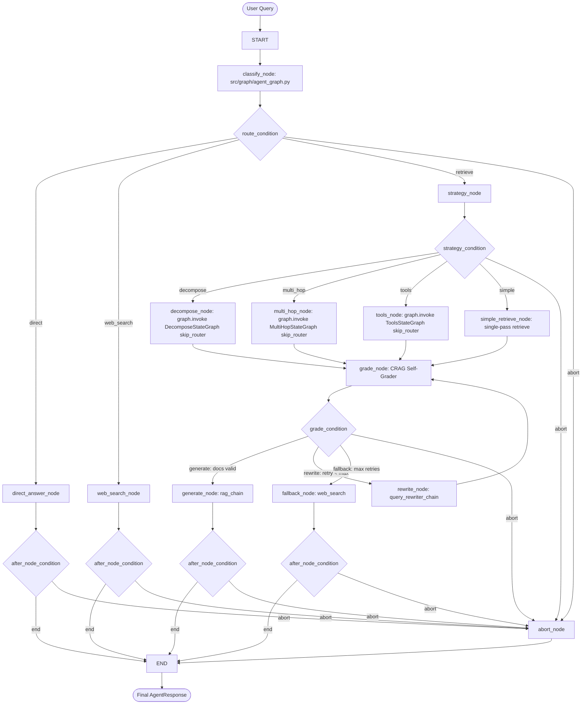
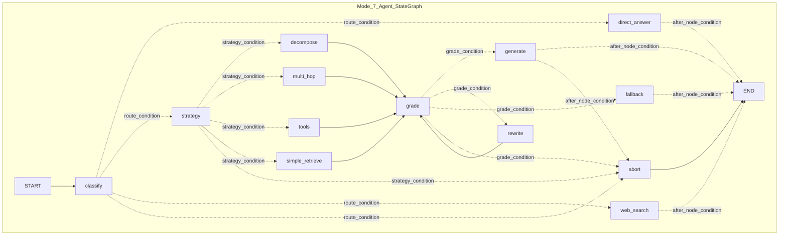

# 🕸️ LANGGRAPH DEEP DIVE — Master Architectural & Code-Level Reference

> **Document Type**: Code-Level Reverse Engineering & Runtime State Execution Manual  
> **Target System**: LangGraph StateGraph implementations in `Agentic_RAG`  
> **Last reviewed against source**: 2026-09-01  
> **Pinned dependency**: `langgraph==1.2.2` (`requirements.txt`) — Pregel runtime.  
> **Source files**: `src/graph/*.py`, `src/agents/*.py`, `src/tools/all_tools.py`, `src/sources/`, `src/resilience/node_gate.py`, `src/streaming.py`, `src/runner.py`.  
> **Not a graph**: Mode 1 `baseline` (`src/rag/baseline.py`) is a linear LCEL pipeline. Eight **modes**; **seven compiled StateGraphs**.

---

# SECTION 1 — START WITH THE BIG PICTURE

### 1.1 Where LangGraph Lives in This Project
In this codebase, LangGraph is not a generic framework layer; it is the **deterministic state machine engine** that coordinates all agentic reasoning, conditional branching, document relevance self-grading loops, map-reduce parallel sub-queries, and multi-agent adversarial debates.

| Lifecycle Stage | Exact Code Location | Core Mechanism |
|---|---|---|
| **State Definition** | `src/graph/*_graph.py` (`RouterState`, `CRAGState`, `DecomposeState`, `MultiHopState`, `ToolsState`, `AgentState`, `ConsensusState`) | `typing.TypedDict` with `Annotated[list, operator.add]` reducers |
| **Graph Initialization** | `build_*_graph()` in each `src/graph/*_graph.py` | `workflow = StateGraph(StateSchema)` |
| **Node Registration** | Inside `build_*_graph()` | `graph.add_node("node_name", node_func)` |
| **Edge Registration** | Inside `build_*_graph()` | `graph.add_edge("source", "target")` |
| **Conditional Edge Registration** | Inside `build_*_graph()` | `graph.add_conditional_edges("source", condition_fn, {mapping})` |
| **Agent / Chain Creation** | `src/agents/*.py` & `src/chains/generation.py` | LCEL pipelines (`PROMPT | llm.with_structured_output(Schema)`) |
| **Tool Registration** | `src/tools/all_tools.py` | `@tool` functions bound via `llm.bind_tools(TOOLS)` |
| **Graph Compilation** | Module-level / cached singleton `get_*_graph()` | `compiled_graph = graph.compile()` returning a `CompiledStateGraph` |
| **Graph Invocation** | `src/streaming.py::run_graph_streaming()` | `graph.stream(initial_state, stream_mode="values")` |
| **Result Extraction** | `ask_*()` functions in each `src/graph/*_graph.py` | Unpacks final state into `src.schemas.AgentResponse` |

---

### 1.2 Master High-Level Architecture Diagram (Mode 7: Full Agentic RAG)



---

# SECTION 2 — LANGGRAPH ENTRY POINTS & COMPILATION ANATOMY

### 2.1 The 7 Compiled Graphs in the System

Every **agentic mode except baseline** is an autonomous compiled `StateGraph`. Dispatch is **not** LangGraph — `src/runner._dispatch` imports `ask_*` by mode string.

1. **`router`** (`src/graph/router_graph.py`): Phase 2 DAG. `classify` → `direct` | `retrieve`→`generate` | `web_search`. **No abort node, no node gates.**
2. **`crag`** (`src/graph/crag_graph.py`): Phase 3. `classify` first, then retrieve loop. Rewrite edge is **`rewrite` → `retrieve` → `grade`** (not rewrite→grade). Route `web_search` and exhausted retries both land on node **`web_fallback`**.
3. **`decompose`** (`src/graph/decompose_graph.py`): Phase 4. `classify` then `Send` map-reduce. `skip_router` lets the parent agentic graph pre-set `route=retrieve`.
4. **`multi_hop`** (`src/graph/multi_hop_graph.py`): Phase 5. `analyze` → `retrieve_hop` → `reflect` loop. Extra stop: single-hop questions synthesize after hop 1.
5. **`tools`** (`src/graph/tools_graph.py`): Phase 6. `classify` → `tools_agent` (Python ReAct loop inside **one** node). Bound tools: `retrieve_docs`, `query_database`, `query_api`, `query_mcp`, `web_search`, `calculator`. Abort after 3 quarantines.
6. **`agentic`** (`src/graph/agent_graph.py`): Phase 7. Router + strategy + **subgraph `.invoke()`** (not `add_node(subgraph)`) + CRAG. Rewrite node **already calls `retrieve()`**, so the loop is **`rewrite` → `grade`**.
7. **`consensus`** (`src/graph/consensus_graph.py`): Phase 8 DAG. Lazy `get_consensus_graph()`. After `retrieve`, a conditional edge **abstains** when there are no documents. Debate is propose → challenge → adjudicate, then `finalize_judgment` (score parse + lexical overlap). Indirect-injection chunks are dropped at retrieve. No `abort` flag.

**Compilation pattern**: all mode graphs use lazy singletons (`get_*_graph()`). `compile()` is called **without** a checkpointer, `interrupt_before`, or `recursion_limit` override (LangGraph default recursion limit is 25). State is **request-scoped**; conversation memory lives in `src/runner.py`, not in LangGraph threads.

---

### 2.2 Compilation Mechanics: What `workflow.compile()` Actually Does

```python
# From src/graph/agent_graph.py (lines 528-605)
def build_full_agent_graph():
    # 1. Instantiate the builder with the State TypedDict contract
    graph = StateGraph(AgentState)

    # 2. Register every node function
    graph.add_node("classify", classify_node)
    graph.add_node("strategy", strategy_node)
    graph.add_node("direct_answer", direct_answer_node)
    graph.add_node("web_search", web_search_node)
    graph.add_node("decompose", decompose_node)
    graph.add_node("multi_hop", multi_hop_node)
    graph.add_node("tools", tools_node)
    graph.add_node("simple_retrieve", simple_retrieve_node)
    graph.add_node("grade", grade_node)
    graph.add_node("generate", generate_node)
    graph.add_node("rewrite", rewrite_node)
    graph.add_node("fallback", fallback_node)
    graph.add_node("abort", abort_node)

    # 3. Connect the entry point
    graph.add_edge(START, "classify")

    # 4. Connect conditional branches
    graph.add_conditional_edges(
        "classify",
        route_condition,
        {
            "direct": "direct_answer",
            "retrieve": "strategy",
            "web_search": "web_search",
            "abort": "abort",
        },
    )
    # ... additional edges ...

    # 5. Compile into an executable Pregel runtime instance
    return graph.compile()
```

#### Line-by-Line Technical Analysis:
- `StateGraph(AgentState)`: Instantiates a graph builder. Internally, LangGraph inspects `AgentState.__annotations__` to discover which fields are standard overwritten values and which fields contain `Annotated[..., reducer]` operations.
- `graph.add_node(name, fn)`: Registers a Python callable. LangGraph wraps this function in a runnable node container. The function signature MUST accept a dictionary matching `AgentState` and return a dictionary of state updates.
- `graph.add_edge(START, "classify")`: Establishes that upon invocation, execution immediately transfers control to the `classify` node.
- `graph.add_conditional_edges(source, condition_fn, path_map)`: Inspects state output after `source` executes, passes state into `condition_fn(state) -> str`, and routes control to the destination node mapped by `path_map[returned_string]`.
- `graph.compile()`: Validates topology (no dangling nodes, conditional targets exist, `START` has an outbound edge, terminals reach `END`). Returns a `CompiledStateGraph` (`langgraph.pregel.Pregel`) executable via `.invoke()` or `.stream()`. This project never passes `checkpointer=`, `interrupt_before=`, or `recursion_limit=`.

**`START` / `END`**: sentinel nodes from `langgraph.graph`. `add_edge(START, "classify")` is the only entry. `END` is a terminal, not a Python function.

**`stream_mode="values"` vs `"updates"`**: `run_graph_streaming` uses `"values"` so each yield is the **full merged state** after a node. That is required to diff `steps` under `operator.add`. `"updates"` would yield only the delta dict per node (harder to emit a cumulative audit trail).

---

# SECTION 3 — STATE: DEEPEST POSSIBLE EXPLANATION

LangGraph uses strict schema typing to guarantee deterministic data transfer between asynchronous or isolated nodes.

### 3.1 Comprehensive State Catalog Across All Modes

#### 1. `AgentState` (`src/graph/agent_graph.py`) — Phase 7 Master Orchestrator

| Field | Type | Initial Value | Written By | Read By | Purpose | Reducer |
|---|---|---|---|---|---|---|
| `question` | `str` | `"..."` (User Query) | Initial caller | All nodes | The original unaltered query string | `None` (Overwrite) |
| `route` | `str` | `""` | `classify_node` | `route_condition` | Intent: `"direct"`, `"retrieve"`, `"web_search"` | `None` (Overwrite) |
| `route_reason` | `str` | `""` | `classify_node` | `ask_agentic()` | LLM's justification for the chosen route | `None` (Overwrite) |
| `strategy` | `str` | `""` | `strategy_node` | `strategy_condition` | Retrieval strategy: `"decompose"`, `"multi_hop"`, `"tools"`, `"simple"` | `None` (Overwrite) |
| `strategy_reason`| `str` | `""` | `strategy_node` | `ask_agentic()` | LLM's justification for strategy selection | `None` (Overwrite) |
| `documents` | `list[Document]` | `[]` | `decompose_node`, `multi_hop_node`, `tools_node`, `simple_retrieve_node`, `rewrite_node` | `grade_node` | Raw candidate chunks retrieved from corpus | `None` (Overwrite) |
| `filtered_documents`| `list[Document]`| `[]` | `grade_node` | `generate_node`, `grade_condition` | Chunks meeting $\ge 0.5$ relevance threshold | `None` (Overwrite) |
| `grade_summary` | `str` | `""` | `grade_node` | `ask_agentic()` | Summary string of chunk grades (e.g. `2/4 relevant`) | `None` (Overwrite) |
| `retry_count` | `int` | `0` | `rewrite_node` | `grade_condition`, `rewrite_node` | Number of query rewrite attempts executed | `None` (Overwrite) |
| `answer` | `str` | `""` | `direct_answer_node`, `web_search_node`, `generate_node`, `fallback_node`, `abort_node` | Caller (`ask_agentic`) | Final synthesized text response | `None` (Overwrite) |
| `sources` | `list[str]` | `[]` | retrieve/generate/fallback/tools subgraphs | `ask_agentic()` | Source labels | `None` (Overwrite) |
| `steps` | `list[str]` | `[]` | **Every Node** | Caller / SSE Stream | Audit trail of agent reasoning steps | `operator.add` (**Append**) |
| `abort` | `bool` | `False` | Node gates in any node | All conditions & nodes | Security or failure circuit-trip flag | `None` (Overwrite) |
| `abort_reason` | `str` | `""` | Node gates in any node | `abort_node` | Human-readable explanation of why run aborted | `None` (Overwrite) |

---

#### 2. `CRAGState` (`src/graph/crag_graph.py`) — Phase 3 Corrective RAG

| Field | Type | Initial Value | Written By | Read By | Purpose | Reducer |
|---|---|---|---|---|---|---|
| `question` | `str` | User Query | Caller | All nodes | Original question | `None` |
| `search_query` | `str` | `question` | `classify_node`, `rewrite_node` | `retrieve_node` | Active search string (rewrite changes this, not `question`) | `None` |
| `route` / `route_reason` | `str` | `""` | `classify_node` | `route_condition`, `ask_crag` | Intent | `None` |
| `documents` | `list[Document]` | `[]` | `retrieve_node` | `grade_node` | Raw chunks | `None` |
| `filtered_documents` | `list[Document]` | `[]` | `grade_node` | `generate_node`, `grade_condition` | Grader-approved chunks | `None` |
| `retry_count` | `int` | `0` | `rewrite_node` | `grade_condition` | Corrective iterations | `None` |
| `grade_summary` | `str` | `""` | `grade_node` | `ask_crag` | Human-readable grades | `None` |
| `web_context` | `str` | `""` | `web_fallback_node` | `ask_crag` context_docs | Live web text | `None` |
| `answer` / `sources` | `str` / `list` | `""` / `[]` | generate / fallback / abort | Caller | Output | `None` |
| `steps` | `list[str]` | `[]` | All nodes | UI / SSE | Audit | `operator.add` |
| `abort` / `abort_reason` | `bool` / `str` | `False` / `""` | Node gates | conditions, `abort_node` | Hard stop | `None` |

**CRAG vs agentic rewrite wiring (easy to mix up):**
- CRAG: `rewrite_node` only rewrites `search_query`; edge is `rewrite → retrieve → grade`.
- Agentic: `rewrite_node` rewrites **and** calls `retrieve()` itself; edge is `rewrite → grade`.

---

#### 3. `RouterState` (`src/graph/router_graph.py`) — Phase 2 (simplest DAG)

| Field | Type | Reducer |
|---|---|---|
| `question`, `route`, `route_reason`, `web_context`, `answer` | `str` | overwrite |
| `documents`, `sources` | `list` | overwrite |
| `steps` | `list[str]` | `operator.add` |

No `abort`. `route_condition` returns `state["route"]` directly (must already be a valid `RouteType` value).

---

#### 4. `DecomposeState` + `RetrieveSubState` (`src/graph/decompose_graph.py`)

| Field | Type | Reducer | Notes |
|---|---|---|---|
| `skip_router` | `bool` | overwrite | Parent agentic sets `True` and pre-fills `route` |
| `sub_queries` | `list[str]` | overwrite | From `decompose_chain` (1–5) |
| `decomposition_reason` | `str` | overwrite | |
| `sub_results` | `list[SubQueryResult]` | **`operator.add`** | Required so parallel `Send` workers merge |
| `steps` | `list[str]` | `operator.add` | Workers each append a retrieve step |

`RetrieveSubState` is the **Send payload**, not the parent schema: `{sub_query, question}`. Worker returns deltas shaped for **parent** fields (`sub_results`, `steps`).

---

#### 5. `MultiHopState` (`src/graph/multi_hop_graph.py`)

| Field | Type | Reducer | Notes |
|---|---|---|---|
| `skip_router` | `bool` | overwrite | Same parent-invoke pattern as decompose |
| `needs_multi_hop` | `bool` | overwrite | From `analyze_chain` |
| `current_hop` | `int` | overwrite | Incremented in `retrieve_hop_node` |
| `search_query` | `str` | overwrite | First hop from analyzer; later from reflector |
| `sufficient` | `bool` | overwrite | Reflector stop flag |
| `hop_results` | `list[HopResult]` | **overwrite** | Node returns `state["hop_results"] + [new_hop]` — **not** `operator.add` |
| `steps` | `list[str]` | `operator.add` | |

`HopResult`: `{hop_number, search_query, finding, documents}`. Finding is filled on the **reflect** pass by replacing the last hop dict.

---

#### 6. `ToolsState` (`src/graph/tools_graph.py`)

| Field | Type | Reducer | Notes |
|---|---|---|---|
| `skip_router` | `bool` | overwrite | |
| `messages` | `list[BaseMessage]` | `operator.add` | Classify seeds `HumanMessage`; ReAct loop mutates a local copy |
| `documents` | `list[Document]` | overwrite | Collected from healthy retrieval tools (`retrieve_docs`, `query_database`, `query_api`, `query_mcp`) |
| `abort` / `abort_reason` | `bool` / `str` | overwrite | 3 quarantines or empty final answer |
| `steps` | `list[str]` | `operator.add` | |

---

#### 7. `ConsensusState` (`src/graph/consensus_graph.py`) — Phase 8 Multi-Agent Debate

| Field | Type | Initial Value | Written By | Read By | Purpose | Reducer |
|---|---|---|---|---|---|---|
| `question` | `str` | User Query | Caller | All 4 nodes | Core inquiry | `None` |
| `documents` | `list[Document]` | `[]` | `retrieve_node` | `format_docs` | Source documents | `None` |
| `context` | `str` | `""` | `retrieve_node` | Proposer, Challenger, Judge | Compressed formatted context | `None` |
| `proposal` | `str` | `""` | `propose_node` | Challenger, Judge | Proposer's initial thesis | `None` |
| `critique` | `str` | `""` | `challenge_node` | Adjudicate node | Adversarial critique | `None` |
| `critique_summary`| `str` | `""` | `challenge_node` | `AgentResponse` | 1-line critique summary | `None` |
| `answer` | `str` | `""` | `adjudicate_node` / `abstain_node` | Caller | Final answer or abstention | `None` |
| `consensus_score` | `float` | `0.0` | `adjudicate_node` / `abstain_node` | Caller | Grounding score ($0.0 \dots 1.0$); default 0.50 if unstated | `None` |
| `steps` | `list[str]` | `[]` | All nodes | UI Trace | Debate step trace | `operator.add` |

---

# SECTION 4 — STATE MUTATION & MERGING MECHANICS

### 4.1 How LangGraph Merges State Updates
A common point of confusion is how state updates propagate between nodes. 

```
                               ┌─────────────────────────┐
                               │ Current Graph State Dict│
                               │ {                       │
                               │   "question": "What...",│
                               │   "retry_count": 0,     │
                               │   "steps": ["Step 1"]   │
                               │ }                       │
                               └────────────┬────────────┘
                                            │
                                            ▼
                               ┌─────────────────────────┐
                               │  Node Function Executes │
                               │  `def rewrite_node(st)` │
                               │                         │
                               │  Returns partial dict:  │
                               │  {                      │
                               │    "retry_count": 1,    │
                               │    "steps": ["Step 2"]  │
                               │  }                      │
                               └────────────┬────────────┘
                                            │
                                            ▼
                               ┌─────────────────────────┐
                               │  LangGraph State Merge  │
                               │                         │
                               │ 1. Standard Fields:     │
                               │    Overwrite key        │
                               │    state["retry_count"] │
                               │    = 1                  │
                               │                         │
                               │ 2. Reducer Fields:      │
                               │    Apply operator.add   │
                               │    state["steps"] =     │
                               │    ["Step 1"]           │
                               │    + ["Step 2"]         │
                               └────────────┬────────────┘
                                            │
                                            ▼
                               ┌─────────────────────────┐
                               │ Resulting Graph State   │
                               │ {                       │
                               │   "question": "What...",│
                               │   "retry_count": 1,     │
                               │   "steps": [            │
                               │     "Step 1", "Step 2"  │
                               │   ]                     │
                               │ }                       │
                               └─────────────────────────┘
```

### 4.2 Why Nodes Return Partial Dicts Instead of Mutating `state` Directly
In LangGraph, **nodes must return a new dictionary representing only the delta (changes)**.
- **Incorrect Pattern**:
  ```python
  def bad_node(state: AgentState) -> dict:
      state["retry_count"] += 1  # Direct in-place mutation breaks time-travel & concurrency
      return state
  ```
- **Correct Pattern Used in This Project**:
  ```python
  def good_node(state: AgentState) -> dict:
      return {
          "retry_count": state["retry_count"] + 1,
          "steps": [f"Query rewrite (attempt {state['retry_count'] + 2})"]
      }
  ```

---

# SECTION 5 — REDUCERS IN-DEPTH

### 5.1 The `operator.add` Reducer
In `AgentState`, `CRAGState`, `DecomposeState`, `MultiHopState`, `ToolsState`, and `ConsensusState`:
```python
steps: Annotated[list[str], operator.add]
```
- `typing.Annotated[T, ReducerFunction]`: Python typing metadata parsed by LangGraph at initialization.
- When `classify_node` returns `{"steps": ["Router -> retrieve"]}` and `strategy_node` returns `{"steps": ["Strategy: decompose"]}`, LangGraph executes:
  $$\text{state}["\text{steps}"] = \text{operator.add}(\text{existing\_steps}, \text{update\_steps})$$
  $$\text{state}["\text{steps}"] = [\text{"Router -> retrieve"}] + [\text{"Strategy: decompose"}] = [\text{"Router -> retrieve"}, \text{"Strategy: decompose"}]$$

### 5.2 The Messages Reducer in `tools_graph.py`
In `ToolsState` (`src/graph/tools_graph.py`):
```python
messages: Annotated[list[BaseMessage], operator.add]
```
`classify_node` seeds `[HumanMessage(content=question)]`. The ReAct loop then runs **inside** `tools_agent_node` on a local `messages = list(state["messages"])` copy, appending `AIMessage` / `ToolMessage` in Python. At the end it returns the **entire** `messages` list.

**Reducer pitfall**: `operator.add` concatenates the returned list onto existing state. Returning the full history (including the classify `HumanMessage`) can duplicate that first message in graph state. The in-node loop still sees a correct local copy; the duplicated channel mainly matters if a later node re-read `state["messages"]` (none currently does after `tools_agent`). Prefer returning **only new messages** as the delta. Same caution if a node copies `steps = list(state["steps"])` and returns the whole list on an `operator.add` field.

### 5.3 `sub_results: Annotated[..., operator.add]` (decompose)
Parallel `Send` workers each return `{"sub_results": [one SubQueryResult]}`. Without the reducer, the last worker would **overwrite** the list and drop sibling retrievals. This is the entire reason decompose uses a reducer on results rather than overwrite.

### 5.4 `hop_results` is **not** a reducer (multi-hop)
`retrieve_hop_node` returns:
```python
"hop_results": state["hop_results"] + [new_hop]
```
That is a full new list (overwrite). `reflect_node` likewise returns a replaced last hop with `finding` filled in. Using `operator.add` here would **append another copy** of the whole history on every hop.

### 5.5 Returning `{}`
Early `if state.get("abort"): return {}` means “no channel updates”. `steps` does not grow. Conditions still see the previous `abort=True`.

---

# SECTION 6 — COMPLETE NODE CATALOG & FUNCTION-LEVEL DEEP DIVE

| Node Name | Source File | Function | Primary Role | State Fields Read | State Fields Modified | External Calls Made |
|---|---|---|---|---|---|---|
| `classify` | `src/graph/agent_graph.py` | `classify_node` | Query Intent Classification | `question` | `route`, `route_reason`, `steps`, `abort` | `router_chain.invoke()` |
| `strategy` | `src/graph/agent_graph.py` | `strategy_node` | Retrieval Strategy Selection | `question` | `strategy`, `strategy_reason`, `steps`, `abort` | `orchestrator.choose_strategy()` |
| `direct_answer`| `src/graph/agent_graph.py` | `direct_answer_node` | Direct Conversational Answer | `question` | `answer`, `sources`, `steps`, `abort` | `direct_chain` via `stream_text` |
| `web_search` | `src/graph/agent_graph.py` | `web_search_node` | Live Web Search Answer | `question` | `answer`, `sources`, `steps`, `abort` | `web_search.invoke()`, `web_search_chain` |
| `decompose` | `src/graph/agent_graph.py` | `decompose_node` | Map-Reduce Sub-Query Subgraph | `question`, `route_reason` | `documents`, `answer`, `sources`, `steps` | Invokes `DecomposeStateGraph` |
| `multi_hop` | `src/graph/agent_graph.py` | `multi_hop_node` | Sequential Hop Subgraph | `question`, `route_reason` | `documents`, `answer`, `sources`, `steps` | Invokes `MultiHopStateGraph` |
| `tools` | `src/graph/agent_graph.py` | `tools_node` | Function Calling Subgraph | `question`, `route_reason` | `documents`, `answer`, `sources`, `steps` | Invokes `ToolsStateGraph` |
| `simple_retrieve`| `src/graph/agent_graph.py`| `simple_retrieve_node`| Direct 1-pass hybrid retrieval| `question` | `documents`, `sources`, `steps` | `retrieve()` |
| `grade` | `src/graph/agent_graph.py` | `grade_node` | CRAG relevance grader | `question`, `documents` | `filtered_documents`, `grade_summary`, `sources`, `steps`, `abort` | `grade_documents()` |
| `rewrite` | `src/graph/agent_graph.py` | `rewrite_node` | Reformulate **and retrieve** | `question`, `retry_count` | `documents`, `sources`, `retry_count`, `steps` | `rewrite_query()`, `retrieve()` |
| `generate` | `src/graph/agent_graph.py` | `generate_node` | RAG from filtered docs or keep tools answer | `filtered_documents`, `answer` | `answer`, `steps`, `abort` | `rag_chain` via `stream_text` |
| `fallback` | `src/graph/agent_graph.py` | `fallback_node` | Web fallback (or keep tools answer) | `question`, `strategy`, `answer` | `answer`, `sources`, `filtered_documents`, `steps` | `web_search`, `web_search_chain` |
| `abort` | `src/graph/agent_graph.py` (also crag/tools) | `abort_node` | Safe user message | `abort_reason` | `answer`, empty docs/sources | `abort_user_message()` |
| `classify` | `src/graph/router_graph.py` | `classify_node` | Route only | `question` | `route`, `route_reason`, `steps` | `router_chain` |
| `retrieve` / `generate` | `src/graph/router_graph.py` | | Linear RAG | docs / context | `documents`, `answer` | `retrieve`, `rag_chain` |
| `classify` | `src/graph/crag_graph.py` | | Same routes; web → `web_fallback` | `question` | `route`, `search_query` | `router_chain`, `check_route` |
| `rewrite` | `src/graph/crag_graph.py` | | Updates `search_query` only | `question` | `search_query`, `retry_count` | `rewrite_query` — **then edge to retrieve** |
| `web_fallback` | `src/graph/crag_graph.py` | | Shared web node (route=web **and** grade fallback) | `question` | `web_context`, `answer` | `web_search` |
| `decompose` / `retrieve_sub` / `synthesize` | `src/graph/decompose_graph.py` | | Map-reduce | sub_queries / Send payload | `sub_results`, `answer` | `decompose_chain`, `retrieve`, `synthesis_chain` |
| `analyze` / `retrieve_hop` / `reflect` / `synthesize` | `src/graph/multi_hop_graph.py` | | Sequential hops | `search_query`, hops | `hop_results`, `sufficient` | `analyze_chain`, `retrieve`, `reflect_chain` |
| `tools_agent` | `src/graph/tools_graph.py` | `tools_agent_node` | In-node ReAct | `messages` | `messages`, `documents`, `answer`, `abort` | `bind_tools`; `RETRIEVAL_TOOL_NAMES` collect Documents via `documents_for_tool` |
| `retrieve` / `propose` / `challenge` / `adjudicate` / `abstain` | `src/graph/consensus_graph.py` | | Retrieve then debate, or abstain | `context`, `proposal`, `critique` | `proposal`, `critique`, `answer`, `consensus_score` | prompts \| llm; `finalize_judgment` score + overlap filter |

---

# SECTION 7 — NODE EXECUTION MODEL & CONTRACT CHECKS

Every node in this codebase adheres to a rigorous 4-step execution lifecycle:

```
                  ┌──────────────────────────────────────────────┐
                  │ 1. Early Abort Check                         │
                  │ if state.get("abort"): return {}             │
                  └──────────────────────┬───────────────────────┘
                                         │
                                         ▼
                  ┌──────────────────────────────────────────────┐
                  │ 2. Core Execution (Agent / LLM / Tool / RAG) │
                  │ result = chain.invoke(...)                   │
                  └──────────────────────┬───────────────────────┘
                                         │
                                         ▼
                  ┌──────────────────────────────────────────────┐
                  │ 3. Node Gate Quarantine                      │
                  │ gate = check_answer(answer, required=True)   │
                  │ if not gate.ok:                              │
                  │   return {"abort": True, "abort_reason": ...}│
                  └──────────────────────┬───────────────────────┘
                                         │
                                         ▼
                  ┌──────────────────────────────────────────────┐
                  │ 4. Delta State Update & Step Audit Return    │
                  │ return {"answer": result, "steps": [...]}    │
                  └──────────────────────────────────────────────┘
```

### Application vs. LangGraph Division of Labor

| Responsibility | Handled by Application Code | Handled by LangGraph Framework |
|---|---|---|
| **State Storage** | Defines TypedDict fields & data contracts | Manages state container memory across node executions |
| **Node Execution** | Implements Python functions (`classify_node`, etc.) | Calls nodes in topological order, passing current state dict |
| **State Merging** | Returns partial dict of mutated values | Executes field overwrites and applies `operator.add` reducers |
| **Branch Routing** | Implements condition logic (`route_condition`, etc.) | Evaluates condition return string against registered path map |
| **Error Handling** | Node gates set `abort=True` on contract violation | Routes to `abort_node` via conditional edge mappings |
| **Streaming** | Pushes SSE events via ContextVar emitter | Emits node transition snapshots via `stream_mode="values"` |

Not every graph uses this lifecycle. **Router, decompose, and multi-hop have no `abort` flag and no node_gate.** Consensus has no `abort` flag; it **abstains** on empty retrieval and quarantines injected chunks at `retrieve_node`. Gates (`check_route`, `check_strategy`, `check_answer`, `check_web_context`, `check_tool_result`) are on **crag, tools, and agentic** only. Indirect injection on tool/web/docs is `scan_context` inside `node_gate` (consensus calls `check_indirect_injection` directly).

Node-gate outcomes: `ok` | `quarantine` (tools: substitute a safe ToolMessage, count toward `MAX_TOOL_FAILURES=3`) | `abort` (set `abort=True`, later `abort_node` + `error_code=node_gate_abort` on `AgentResponse`).

---

### 8.1 Complete Edge & Conditional Edge Registry



### 8.2 Conditional Decision Logic in Detail

#### 1. `route_condition` (`src/graph/agent_graph.py`, line 486)
```python
def route_condition(state: AgentState) -> Literal["direct", "retrieve", "web_search", "abort"]:
    if state.get("abort"):
        return "abort"
    if state["route"] == RouteType.DIRECT.value:
        return "direct"
    if state["route"] == RouteType.WEB_SEARCH.value:
        return "web_search"
    if state["route"] == RouteType.RETRIEVE.value:
        return "retrieve"
    return "abort"
```

#### 2. `strategy_condition` (`src/graph/agent_graph.py`, line 500)
```python
def strategy_condition(state: AgentState) -> Literal["decompose", "multi_hop", "tools", "simple", "abort"]:
    if state.get("abort"):
        return "abort"
    return normalize_strategy(state.get("strategy"))
```

#### 3. `grade_condition` (`src/graph/agent_graph.py`, line 508)
```python
def grade_condition(state: AgentState) -> Literal["generate", "rewrite", "fallback", "abort"]:
    if state.get("abort"):
        return "abort"
    # Case A: At least 1 chunk passed relevance grading (score >= 0.5)
    if state["filtered_documents"]:
        return "generate"
    # Case B: Tool-agent answered using calculation/external tool (no corpus docs needed)
    if state.get("strategy") == "tools" and state.get("answer"):
        return "generate"
    # Case C: All chunks failed grading, but retry budget remains (retry < 2)
    if state["retry_count"] < settings.max_retrieval_retries:
        return "rewrite"
    # Case D: Retry budget exhausted → fallback (agentic: node `fallback`; CRAG: node `web_fallback`)
    return "fallback"
```

`max_retrieval_retries` default is **2**, so rewrite can run twice (`retry_count` 0→1→2) before fallback.

---

### 8.3 The Other Six Graphs (edges only)

**Router** — pure DAG, no abort:
`START → classify ⇢ direct_answer | retrieve | web_search`. `retrieve → generate → END`. Direct and web go to `END`.

**CRAG**:
`START → classify ⇢ direct_answer | retrieve | web_fallback | abort`.
`retrieve → grade ⇢ generate | rewrite | web_fallback | abort`.
`rewrite → retrieve` (search_query already updated).
`generate` / `direct_answer` / `web_fallback` ⇢ `after_node_condition` → END or abort. `abort → END`.

**Decompose**:
`START → classify ⇢ direct | decompose | web_search`.
`decompose ⇢ Send fan_out → retrieve_sub` (path map is a **list** `["retrieve_sub"]`, not a dict — every Send targets that node).
`retrieve_sub → synthesize → END`.

**Multi-hop**:
`START → classify ⇢ direct | analyze | web_search`.
`analyze → retrieve_hop → reflect ⇢ retrieve_hop | synthesize`.
`reflect_condition`: `sufficient` → synthesize; **not** `needs_multi_hop` and `current_hop >= 1` → synthesize; `current_hop >= MAX_MULTI_HOP_STEPS` (3) → synthesize; else loop.

**Tools**:
`START → classify ⇢ direct | tools_agent | web_search | abort`.
`tools_agent` / direct / web ⇢ `after_node_condition`. `abort → END`.

**Consensus** — no conditionals:
`START → retrieve → propose → challenge → adjudicate → END`.

---

# SECTION 8.4 — SUBGRAPHS ARE `.invoke()`, NOT NESTED `StateGraph` NODES

LangGraph can mount a compiled graph as a node (`parent.add_node("decompose", child_graph)`), which auto-maps overlapping state keys. **This repo does not do that.**

Agentic `decompose_node` / `multi_hop_node` / `tools_node`:
1. `from src.graph.*.py import get_*_graph`
2. `with suppress_token_emit(): result = graph.invoke({...})`
3. Seed child state with `skip_router=True`, `route=retrieve`, empty `steps` / `sub_results`
4. Copy **selected** fields back: `documents`, `answer`, `sources`, plus one parent `steps` line

Consequences:
- Child `steps` audit is **discarded** (not merged into the parent trace) — the UI sees one summary line per subgraph.
- Child tokens would otherwise stream before agentic re-generates after grading — hence `suppress_token_emit`.
- `skip_router` short-circuits child `classify_node` so the parent router decision is not re-run (and cannot disagree).
- Parent and child state schemas are **different TypedDicts**; only the hand-copied keys survive.

Send API parallelism exists **only inside** the decompose graph, not at the agentic layer.

---

# SECTION 9 — MAP-REDUCE & THE LANGGRAPH `Send` API

In Phase 4 (`src/graph/decompose_graph.py`), query decomposition utilizes the LangGraph **`Send` API** for dynamic parallel map-reduce:

```python
# From src/graph/decompose_graph.py
def fan_out_to_retrieve(state: DecomposeState) -> list[Send]:
    """LangGraph Send: dispatch parallel retrieval workers (map step)."""
    return [
        Send("retrieve_sub", {"sub_query": sq, "question": state["question"]})
        for sq in state["sub_queries"]
    ]

# Registration uses the list form of path_map — every Send must target retrieve_sub:
# graph.add_conditional_edges("decompose", fan_out_to_retrieve, ["retrieve_sub"])
```

Each `Send(node_name, payload)` schedules an independent Pregel task. The payload **is** the worker state (`RetrieveSubState`). Workers must return channels that exist on the **parent** (`sub_results` + `steps`) so the reducers can join. After all Sends finish, Pregel follows `retrieve_sub → synthesize` once.

Empty `sub_queries` would emit zero Sends — `synthesize` would then see empty `sub_results`. The decomposer schema enforces `min_length=1`.

```
                        ┌─────────────────────────────────────┐
                        │      `decompose_node` (Map Prep)    │
                        │ Decomposes into ["Sub-Q1", "Sub-Q2"]│
                        └──────────────────┬──────────────────┘
                                           │
                                           ▼
                        ┌─────────────────────────────────────┐
                        │ `fan_out_to_retrieve` (Send API)    │
                        │ Emits [Send(worker1), Send(worker2)]│
                        └──────────┬────────────────┬─────────┘
                                   │                │
                    ┌──────────────▼──────┐   ┌─────▼───────────────┐
                    │ `retrieve_sub_node` │   │ `retrieve_sub_node` │
                    │ Worker 1: Sub-Q 1   │   │ Worker 2: Sub-Q 2   │
                    └──────────────┬──────┘   └─────┬───────────────┘
                                   │                │
                                   └────────┬───────┘
                                            │
                                            ▼
                        ┌─────────────────────────────────────┐
                        │    `synthesize_node` (Reduce Step)  │
                        │ Combines contexts & synthesizes     │
                        └─────────────────────────────────────┘
```

---

# SECTION 10 — REACT TOOL CALLING LOOP IN `tools_graph.py`

In Phase 6 (`src/graph/tools_graph.py`), tool execution uses LangChain's native function calling bound to `tools_agent_node`:

```python
# From src/graph/tools_graph.py — tools_agent_node (abbreviated, matches source)
def tools_agent_node(state: ToolsState) -> dict:
    if state.get("abort"):
        return {}
    llm = get_llm().bind_tools(TOOLS)
    messages = list(state["messages"])
    steps = list(state.get("steps", []))
    collected_docs, tool_failures = [], 0

    for iteration in range(10):
        response = stream_llm_message(llm, messages)
        messages.append(response)
        if not response.tool_calls:
            break

        for tool_call in response.tool_calls:
            tool_name, tool_input = tool_call["name"], tool_call["args"]
            # Retrieval tools are special-cased so Document objects can be collected
            if tool_name in RETRIEVAL_TOOL_NAMES:
                query = str(tool_input.get("query", state["question"]))
                docs_this_call = documents_for_tool(tool_name, query)
                result = format_docs(docs_this_call) if docs_this_call else f"{PREFIX_TOOL_EMPTY} {TOOL_EMPTY_DETAIL.get(tool_name, 'No results.')}"
            elif tool_name in TOOL_MAP:
                result = TOOL_MAP[tool_name].invoke(tool_input)
            else:
                result = f"Tool {tool_name} not found"

            gate = check_tool_result(tool_name, str(result))
            if gate.severity == "quarantine":
                tool_failures += 1
                messages.append(ToolMessage(content=quarantine_tool_message(gate, tool_name), tool_call_id=tool_call["id"]))
                if tool_failures >= MAX_TOOL_FAILURES:  # 3
                    return {"abort": True, "abort_reason": "...", "messages": messages, ...}
                continue  # quarantined result is NOT treated as evidence

            if tool_name in RETRIEVAL_TOOL_NAMES:
                collected_docs.extend(docs_this_call)
            messages.append(ToolMessage(content=str(result), tool_call_id=tool_call["id"]))

    # check_answer on final content; abort if < 10 chars
    return {"answer": final_answer, "messages": messages, "documents": collected_docs, "steps": steps}
```

`stream_llm_message` emits SSE `token` events only for **non-tool-call** turns (so calculator JSON does not stream as fake answer text).

This ReAct loop is **inside one LangGraph node**. LangGraph does not see the 10 inner iterations as graph steps; SSE `step` events for tool calls are appended to `steps` and flushed when the node returns (via `run_graph_streaming`).

---

# SECTION 11 — GRAPH LOOPS, RETRIES & RECURSION SAFETY

### 11.1 The 3 Loops in This Architecture

1. **CRAG Corrective Rewrite Loop** (`crag_graph.py` **and** `agent_graph.py` — different edges):
   - **CRAG path**: `grade` → `rewrite` → `retrieve` → `grade`. `rewrite` only changes `search_query`.
   - **Agentic path**: `grade` → `rewrite` → `grade`. `rewrite_node` already calls `retrieve()`.
   - **Stop**: `retry_count >= max_retrieval_retries` (default 2) → `fallback` / `web_fallback`.
   - **Agentic extra**: if `strategy == "tools"` and a prior `answer` exists, `grade_condition` goes to `generate` even with empty filtered docs; `fallback_node` prefers that tools answer over web.

2. **Multi-Hop Reasoning Loop** (`multi_hop_graph.py`):
   - **Path**: `retrieve_hop` → `reflect` → `retrieve_hop`.
   - **Stop**: `sufficient` OR (`not needs_multi_hop` and `current_hop >= 1`) OR `current_hop >= max_multi_hop_steps` (3).

3. **ReAct Tool Calling Loop** (`tools_graph.py`):
   - **Path**: Python `for iteration in range(10)` inside `tools_agent_node` (not a graph cycle).
   - **Stop**: no `tool_calls` OR 10 iterations OR `tool_failures >= 3` (abort).

LangGraph's default **`recursion_limit=25`** is left unchanged. Worst case agentic (2 rewrites + subgraph nodes) stays well under 25 graph supersteps. An unbounded graph cycle without these caps would raise `GraphRecursionError`.

---

# SECTION 12 — GRAPH INVOCATION & STREAMING INTEGRATION

### 12.1 How `run_graph_streaming` Drives Execution
LangGraph execution is synchronous and blocking. To deliver progressive Server-Sent Events (SSE) to the frontend, `src/streaming.py` streams graph step completions using `stream_mode="values"`:

```python
# From src/streaming.py (lines 150-173)
def run_graph_streaming(graph: Any, initial_state: dict) -> dict:
    """Run a compiled LangGraph, emitting steps as nodes complete."""
    final: dict | None = None
    seen_steps = 0
    
    # graph.stream with "values" yields the FULL state dict after every node execution
    for state in graph.stream(initial_state, stream_mode="values"):
        final = state
        steps = state.get("steps") or []
        
        # Emit newly added audit steps to active SSE stream
        if len(steps) > seen_steps:
            for s in steps[seen_steps:]:
                emit_step(s)
            seen_steps = len(steps)
            
    return final if final is not None else initial_state
```

`ask_*` wrappers all call `run_graph_streaming` (not raw `.invoke`), then `build_response(...)`. Aborting graphs set `error_code="node_gate_abort"` and strip docs/sources. Consensus additionally copies `consensus_score` / `critique_summary`. Follow-ups are **not** a graph node — `src/runner._attach_follow_ups` runs after the graph returns.

### 12.2 Preventing Subgraph Event Pollution (`suppress_token_emit`)
When Mode 7 (`agent_graph.py`) invokes subgraphs (e.g. `get_decompose_graph().invoke(...)`), tokens generated inside the subgraph could conflict with Mode 7's final generation node. 
- Solution: `src/streaming.py::suppress_token_emit()` uses a `ContextVar[bool]` to temporarily silence token emission during subgraph execution:
  ```python
  with suppress_token_emit():
      result = graph.invoke(initial_subgraph_state)
  ```

`stream_text` / `stream_llm_message` no-op on tokens when no emitter is installed (CLI / POST `/query`). SSE disconnect raises `CancelledRun(BaseException)` from the emitter so node `except Exception` handlers cannot keep the Pregel loop billing.

---

# SECTION 12.3 — WHAT LANGGRAPH DOES **NOT** DO HERE

| Feature | Status in this repo |
|---|---|
| Checkpointer (`MemorySaver`, Sqlite, Postgres) | **Unused** — no `thread_id`, no replay/time-travel |
| `interrupt_before` / human-in-the-loop | **Unused** |
| Nested `add_node("child", compiled_subgraph)` | **Unused** — manual `.invoke()` instead |
| `Command` / dynamic `goto` | **Unused** — string path maps only |
| Store / long-term memory channels | **Unused** — Supabase + prompt packing sit in the runner |
| `recursion_limit` override | Default 25 |
| Baseline mode | **Not a graph** |

---

# SECTION 13 — COMPLETE STEP-BY-STEP STATE TRACE (REAL QUERY)

Let us trace state mutations for the query:
$$\mathbf{Q}: \text{"Compare Self-RAG and CRAG"}$$
Executed in Mode 7 (`agentic`).

```python
# ==============================================================================
# STATE AT START (Initial Dict passed to run_graph_streaming)
# ==============================================================================
state_0 = {
    "question": "Compare Self-RAG and CRAG",
    "route": "",
    "route_reason": "",
    "strategy": "",
    "strategy_reason": "",
    "documents": [],
    "filtered_documents": [],
    "grade_summary": "",
    "retry_count": 0,
    "answer": "",
    "sources": [],
    "steps": [],
    "abort": False,
    "abort_reason": "",
}

# ==============================================================================
# STEP 1: After classify_node executes
# ==============================================================================
# Output delta: {"route": "retrieve", "route_reason": "Inquiry requires internal RAG paper facts", "steps": ["Router -> retrieve: Inquiry requires internal RAG paper facts"]}
state_1 = {
    **state_0,
    "route": "retrieve",
    "route_reason": "Inquiry requires internal RAG paper facts",
    "steps": [
        "Router -> retrieve: Inquiry requires internal RAG paper facts"
    ]
}

# ==============================================================================
# STEP 2: After strategy_node executes (route_condition routed to "strategy")
# ==============================================================================
# Output delta: {"strategy": "decompose", "strategy_reason": "Comparative question involves multiple frameworks", "steps": ["Strategy: decompose — Comparative question involves multiple frameworks"]}
state_2 = {
    **state_1,
    "strategy": "decompose",
    "strategy_reason": "Comparative question involves multiple frameworks",
    "steps": [
        "Router -> retrieve: Inquiry requires internal RAG paper facts",
        "Strategy: decompose — Comparative question involves multiple frameworks"
    ]
}

# ==============================================================================
# STEP 3: After decompose_node executes (strategy_condition routed to "decompose")
# ==============================================================================
# Child graph.invoke() with skip_router=True. Inner Send workers + synthesize run
# inside the child; parent only copies documents/answer/sources and ONE summary step.
# Child steps/tokens are discarded / suppressed.
# Output delta: {"documents": [Doc1, Doc2, ... Doc8], "steps": ["Decomposed into 2 sub-queries (8 chunks) — grading next"]}
state_3 = {
    **state_2,
    "documents": [Document(page_content="Self-RAG uses reflection tokens..."), Document(page_content="CRAG uses a document evaluator...")],
    "steps": [
        "Router -> retrieve: Inquiry requires internal RAG paper facts",
        "Strategy: decompose — Comparative question involves multiple frameworks",
        "Decomposed into 2 sub-queries (8 chunks) — grading next"
    ]
}

# ==============================================================================
# STEP 4: After grade_node executes
# ==============================================================================
# Grader evaluates each chunk. 6/8 chunks pass relevance threshold (score >= 0.5).
# Output delta: {"filtered_documents": [Doc1, Doc2, ... Doc6], "grade_summary": "6/8 relevant", "steps": ["Grader: 6/8 chunks relevant"]}
state_4 = {
    **state_3,
    "filtered_documents": [Document(page_content="Self-RAG uses reflection tokens..."), Document(page_content="CRAG uses a document evaluator...")],
    "grade_summary": "6/8 relevant",
    "steps": [
        "Router -> retrieve: Inquiry requires internal RAG paper facts",
        "Strategy: decompose — Comparative question involves multiple frameworks",
        "Decomposed into 2 sub-queries (8 chunks) — grading next",
        "Grader: 6/8 chunks relevant"
    ]
}

# ==============================================================================
# STEP 5: After generate_node executes (grade_condition routed to "generate")
# ==============================================================================
# rag_chain streams synthesized comparison from the 6 approved chunks.
# Output delta: {"answer": "Self-RAG and CRAG differ primarily in...", "steps": ["Generated from 6 relevant chunks"]}
state_5 = {
    **state_4,
    "answer": "Self-RAG and CRAG differ primarily in their evaluation placement...",
    "steps": [
        "Router -> retrieve: Inquiry requires internal RAG paper facts",
        "Strategy: decompose — Comparative question involves multiple frameworks",
        "Decomposed into 2 sub-queries (8 chunks) — grading next",
        "Grader: 6/8 chunks relevant",
        "Generated from 6 relevant chunks"
    ]
}

# ==============================================================================
# TERMINATION: after_node_condition routes "generate" to END
# ==============================================================================
# ask_agentic() extracts final state and constructs AgentResponse with full citation metadata.
```

---

# SECTION 14 — COMMON CONFUSIONS & ARCHITECTURAL CLARIFICATIONS

### 1. LangGraph Node vs. Agent
- **Node**: A structural wrapper in the directed graph (`def node_fn(state) -> dict`). Its job is to read state, invoke business logic, run security gates, and return a dictionary delta.
- **Agent**: The reasoning entity (an LCEL chain with structured output, e.g. `router_chain` or `grader_chain`). An agent runs *inside* a node.

### 2. Graph Loop vs. Agent Loop vs. Subgraph Invoke
- **Graph loop**: CRAG `grade → rewrite → retrieve → grade`; agentic `grade → rewrite → grade`; multi-hop `retrieve_hop → reflect → retrieve_hop`. Edges persist state across nodes.
- **Agent loop**: `for _ in range(10)` inside `tools_agent_node`. Inner iterations are invisible to Pregel.
- **Subgraph invoke**: agentic calls another compiled graph as a plain Python function (`graph.invoke`). Not a LangGraph nested-graph node.

### 3. CRAG `rewrite → retrieve` vs Agentic `rewrite → grade`
Same *idea* (corrective retrieval), different node responsibilities. Copy-pasting one edge table onto the other is wrong.

### 4. `hop_results` overwrite vs `sub_results` reducer
Map-reduce **must** reduce. Sequential hops **must not**, or history duplicates. See §5.3–5.4.

### 5. State Update (`return {"answer": "..."}`) vs. In-Place Mutation
- LangGraph does **not** diff old state vs new state. It applies the returned update dictionary onto the state container. Returning `{}` means "no changes". Returning a value overwrites the existing key unless the field has an `Annotated[..., reducer]` decorator.

---

# SECTION 15 — COMPONENT REMOVAL IMPACT ANALYSIS

| Component | What Breaks if Removed? | Graph Still Compiles? | Runtime Failure Mode |
|---|---|---|---|
| `grade_node` in `agent_graph.py` | CRAG safety net lost; unverified/irrelevant chunks stuffed into LLM context | Yes (if edges re-wired) | Hallucination rate increases when retriever fetches low-relevance chunks |
| `web_fallback` / `fallback` node | No recovery after empty grades | No | First miss → empty or abort depending on gates |
| `skip_router=True` seed | Child graphs re-classify independently | Yes | Parent `retrieve` decision can be overridden to `direct`/`web` |
| Returning full `messages`/`steps` on `operator.add` | Duplicate HumanMessage / classify steps in channel | Yes | Usually latent; breaks if a later node re-reads the channel |
| `stream_mode="values"` | Harder to emit cumulative `steps` | Yes | SSE would miss or reorder audit lines if switched to `"updates"` without rewriting the runner |
| `Annotated[..., operator.add]` on `steps` | Step audit logs are wiped on every node execution | Yes | UI and API only receive steps from the very last node that executed |
| `node_gate` checks in nodes | Malicious output injection payloads or empty LLM answers propagate unchecked | Yes | Silent failures, UI crashes, potential markdown exfiltration vulnerabilities |
| `suppress_token_emit()` | Subgraphs emit duplicate token events over SSE | Yes | Client UI displays overlapping, duplicated streamed sentences |

---

# SECTION 16 — FINAL STUDY SEQUENCE FOR LANGGRAPH MASTERY

To master how LangGraph works in this repository, study the codebase in this precise order:

```
1. `src/schemas.py` ──────────────> Understand domain contracts (AgentResponse, Citation)
           │
           ▼
2. `src/graph/router_graph.py` ───> Simplest DAG: StateGraph, classify_node, route_condition
           │
           ▼
3. `src/graph/crag_graph.py` ─────> Graph loop: rewrite → retrieve → grade (not rewrite→grade)
           │
           ▼
4. `src/graph/decompose_graph.py` ─> Map-Reduce: `Send` + `sub_results` reducer
           │
           ▼
5. `src/graph/multi_hop_graph.py` ─> Sequential loop: overwrite `hop_results`, hop cap
           │
           ▼
6. `src/graph/tools_graph.py` ────> In-node ReAct, quarantine, `MAX_TOOL_FAILURES`
           │
           ▼
7. `src/graph/consensus_graph.py` ─> Retrieve → debate or abstain; lexical score backstop
           │
           ▼
8. `src/graph/agent_graph.py` ────> Meta-orchestrator: `.invoke()` subgraphs, CRAG, abort
           │
           ▼
9. `src/streaming.py` ────────────> `stream_mode="values"`, tokens, `CancelledRun`
           │
           ▼
10. `src/runner.py` ──────────────> Mode dispatch, follow-ups, cache — **outside** the graphs
```
