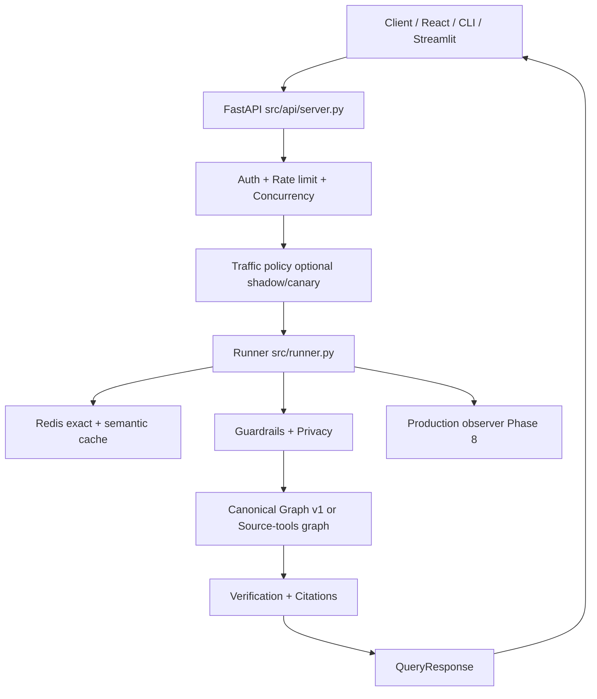

# Architecture — Canonical Agentic RAG (v1)

**Status: CURRENT** — production architecture as of Phase 8.

> Historical evolution: [ROADMAP.md](./ROADMAP.md), [LEGACY_RETIREMENT_INVENTORY.md](./LEGACY_RETIREMENT_INVENTORY.md)

## Pipeline version

```text
canonical_pipeline_version = v1
```

## Production request flow



## Layer responsibilities

| Layer | Modules | Responsibility |
|-------|---------|----------------|
| **API** | `src/api/server.py`, `documents.py`, `health.py`, `metrics.py` | HTTP, SSE, auth, ops endpoints |
| **Runner** | `src/runner.py`, `src/runner_modes.py` | Dispatch, cache, budget, guardrails, mode deprecation |
| **Canonical graph** | `src/graph/canonical_graph.py` | Default LangGraph workflow |
| **Source-tools graph** | `src/graph/source_tools_graph.py` | LLM-selected PDF / DB / API / MCP / calculator + CRAG grade |
| **Contracts** | `src/contracts/` | State, evidence, verification, API mapping |
| **Retrieval** | `src/retrieval/`, `src/sources/` | Hybrid retrieve, federation, rerank, RBAC |
| **Ingestion** | `src/ingestion/`, `document_registry.py` | Chunk, embed, version documents |
| **Security** | `src/security/`, `guardrails.py`, `privacy.py` | Injection, PII, rate limits |
| **Cache** | `src/cache/` | Redis exact + semantic (pipeline-version keyed) |
| **Evaluation** | `src/evaluation/` | Shadow, canary, continuous eval, gates |
| **Observability** | `src/observability.py`, `src/canonical_observability/`, Prometheus | LangSmith parent traces, node timing, OTEL optional |

## Canonical graph stages

```text
Query Understanding (classify)
  → Strategy Selection (heuristic + optional LLM)
  → Retrieval (deterministic plan + hybrid search + federation)
  → Evidence Management (grade, rewrite loop)
  → Context Construction (compression, token budget)
  → Generation (rag_chain / direct / web)
  → Verification (rules + optional LLM judge)
  → Response (citations, status, follow-ups)
```

Detail: [LANGGRAPH.md](./LANGGRAPH.md).

## State & contracts

- **State:** `CanonicalAgentState` — frozen Pydantic model
- **Evidence:** explicit provenance from retrieval results
- **Citations:** mapped from evidence IDs (`citation_mapper.py`)
- **Verification:** `VerificationResult` on exact generation evidence
- **API bridge:** `canonical_to_api_response()` in `src/contracts/api_response.py`

## Agent vs deterministic boundaries

| LLM decisions | Deterministic |
|---------------|---------------|
| Router (route) | Hybrid retrieval, BM25, RRF |
| Strategy selector | Retrieval plan execution |
| Document grader | Reranking, deduplication |
| Query rewriter | Parent expansion, federation merge |
| Generator | Citation index mapping |
| Verifier (optional) | Token budgeting, cache keys |
| Web search synthesis | SSRF-safe URL validation |

Production **canonical** graph does **not** expose an in-graph ReAct tool loop. Extra sources federate into `retrieve()` when `MULTI_SOURCE_ENABLED=true`. `@tool` wrappers in `all_tools.py` support federation tests.

**Tool-selected sources** (`mode=source_tools`) is a separate public graph (`source_tools_graph.py`): the LLM chooses `retrieve_pdf`, `query_database`, `query_api`, `query_mcp`, or `calculator`. PDF/DB/API/MCP hits are CRAG-graded (`grade_documents`) before they return to the model or become citations. Calculator results are not graded.

## Retrieval pipeline

```text
Ingest → cleanse → chunk (parent-child) → embed → Chroma
Query → hybrid dense+BM25 (RRF) or MMR → rerank → RBAC filter
      → optional extra sources (SQLite, API, MCP) → parent expand
      → evidence grading → context compression → generation
```

Config: `src/config.py` (`retrieval_*`, `rerank_*`, `multi_source_*`).

## Security

| Control | Implementation |
|---------|----------------|
| API key auth | `src/api/security.py` |
| RBAC / tenant | `RBACContext`, retrieval filters |
| Prompt injection | `src/security/`, input guardrails |
| PII/PHI | `src/privacy.py` |
| SSRF (web) | `src/tools/safe_web.py` |
| Path traversal (ingest) | Allowed roots |
| Rate / cost limits | `guardrails.py`, Prometheus |

See [GUARDRAILS.md](./GUARDRAILS.md).

## Failure handling

| Condition | Behavior |
|-----------|----------|
| Canonical / verification failure | `safe_abstention_response()` when `legacy_runtime_enabled=false` |
| Guardrail abort | `error_code` set; no cache write |
| Canary kill switch | Traffic policy returns legacy path label or abstention |
| Capacity | HTTP 503 with `Retry-After` |

## Observability

- Prometheus: `GET /metrics`
- Canonical node latency: `rag_canonical_*` metrics
- Phase 8 dashboard: `GET /ops/quality/dashboard`
- Optional OpenTelemetry: `otel_enabled=true`
- LangSmith: parent span `agent_request:<mode>` wrapping classify, retrieve, grade, graph nodes, generation, and follow-ups — [LANGSMITH_TRACING.md](./LANGSMITH_TRACING.md)

## Deprecated client modes

API accepts legacy mode strings for backward compatibility; they map to canonical strategies via `runner_modes.py` and emit `rag_deprecated_mode_requests_total`.

**Public modes (`GET /modes`):** `canonical` (preferred) and `source_tools`.

## Scaling model

- API: async FastAPI + thread pool for sync graph
- Concurrency ceiling: `max_concurrent_queries`
- Redis: shared cache and rate limits (optional)
- Chroma: persistent or HTTP mode
- Shadow eval: background thread pool (`shadow_max_workers`)

## Related docs

| Doc | Topic |
|-----|-------|
| [LANGGRAPH.md](./LANGGRAPH.md) | Graph nodes and edges |
| [API.md](./API.md) | HTTP routes |
| [EVALUATION.md](./EVALUATION.md) | Metrics and gates |
| [PHASE8_CONTINUOUS_EVAL.md](./PHASE8_CONTINUOUS_EVAL.md) | Continuous improvement loop |
| [PRODUCTION.md](./PRODUCTION.md) | Deployment |
| [DOCUMENTATION_MAP.md](./DOCUMENTATION_MAP.md) | Doc index |
