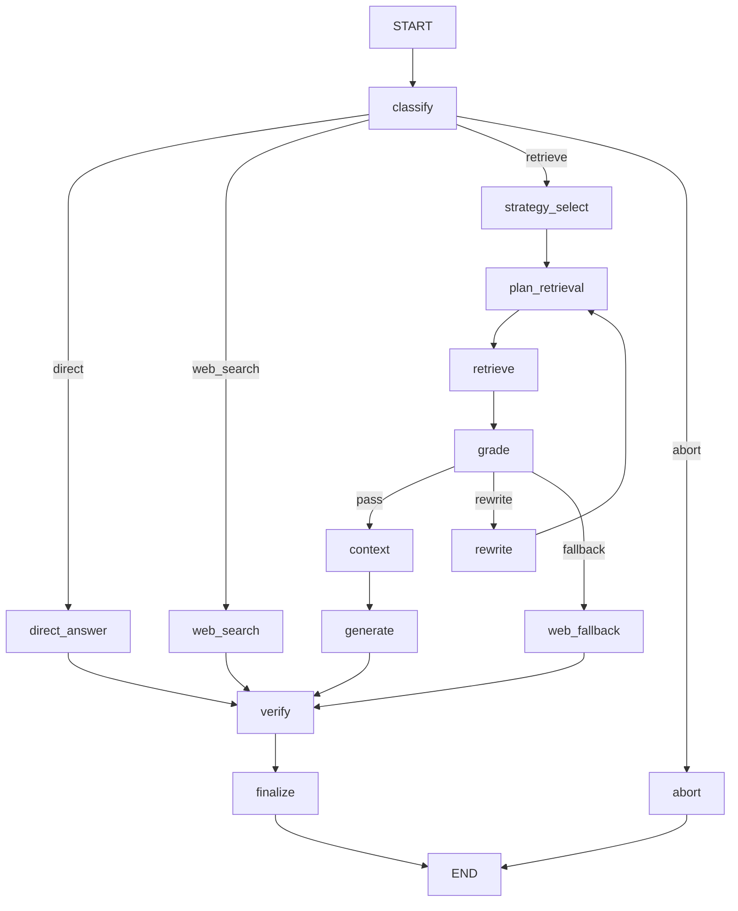

# LangGraph — Current Canonical Graph (v1)

**Status: CURRENT** — describes production code in `src/graph/canonical_graph.py`.

> Historical note: [LANGGRAPH_DEEP_DIVE.md](../LANGGRAPH_DEEP_DIVE.md) documents the **removed** seven-graph architecture (Phases 2–8). Do not use it for production behavior.

## Terminology

| Term | Meaning in this repo |
|------|---------------------|
| **Agent** | An LLM that makes a decision (router, grader, strategy selector, verifier when LLM enabled) |
| **Workflow / Graph** | The compiled LangGraph `StateGraph` — deterministic control flow |
| **Node** | A Python function registered on the graph; may call agents or deterministic code |
| **Tool** | LangChain `@tool` callable (e.g. `web_search`, `calculator`) — **not** LLM-selectable in production today |
| **Application function** | Deterministic code: `retrieve()`, rerank, evidence processing, citation mapping |
| **State** | `CanonicalAgentState` carried through the graph |
| **Edge** | Fixed transition between nodes |
| **Conditional edge** | Branch on state (route, grade outcome, strategy) |

## State model

Production state is **`CanonicalAgentState`** (`src/contracts/state.py`), serialized through `CanonicalGraphState` (`src/graph/canonical_state.py`).

Key fields:

| Field | Role |
|-------|------|
| `original_question` | Immutable user question |
| `route` | `direct` \| `retrieve` \| `web_search` |
| `strategy` | `simple` \| `decompose` \| `multi_hop` |
| `strategy_decision_source` | `heuristic` \| `llm` |
| `retrieval_plan` / `retrieval_results` | Deterministic retrieval boundary |
| `evidence` | Graded evidence with provenance |
| `generation_evidence_ids` | Exact evidence used for generation |
| `citations` | User-facing citation objects linked to evidence |
| `verification` | `VerificationResult` |
| `response_status` | `answered` \| `answered_with_warning` \| `abstained` |
| `retry_count` | CRAG-style rewrite attempts |
| `trace` | Append-only `TraceEvent` log |

Legacy state types (`RouterState`, `CRAGState`, `AgentState`, etc.) were **removed** in Phase 7.

## Graph topology

Built by `build_canonical_graph()` in `src/graph/canonical_graph.py`.

## Nodes

| Node | Type | Module | Responsibility |
|------|------|--------|----------------|
| `classify` | Agent + fallback | `shared_nodes.invoke_router` | Route: direct / retrieve / web |
| `direct_answer` | Agent | `shared_nodes.run_direct_answer` | Answer without retrieval |
| `web_search` | Agent + tool | `shared_nodes.run_web_search_answer` | Web search + synthesis |
| `strategy_select` | Agent/heuristic | `strategy_heuristics.select_strategy` | Pick simple / decompose / multi_hop |
| `plan_retrieval` | Deterministic | `retrieval/canonical_adapter.build_retrieval_plan` | Build retrieval plan |
| `retrieve` | Deterministic | `canonical_adapter.execute_retrieval_plan` | Hybrid retrieve + federation |
| `grade` | Agent | `evidence_management.process_evidence_candidates` | Grade / filter evidence |
| `rewrite` | Agent | `query_rewriter.rewrite_query` | Reformulate on failed grade |
| `reflect` | Agent | `multi_hop.reflect_on_hop` | Multi-hop sufficiency (when used) |
| `context` | Deterministic | `context_builder.build_generation_context` | Context + token budget |
| `generate` | Agent | `rag_chain` via `stream_text` | Grounded generation |
| `verify` | Agent + rules | `verification_engine.verify_response` | Faithfulness / relevance |
| `finalize` | Deterministic | `citation_mapper`, response assembly | Citations + status |
| `abort` | Deterministic | Safe user message | Guardrail / gate abort |
| `web_fallback` | Agent + tool | Same as web search path | Grade failure fallback |

## Conditional edges

1. **After `classify`:** route → direct_answer | web_search | strategy_select | abort
2. **After `grade`:** sufficient evidence → context; retry budget → rewrite; else → web_fallback
3. **After `rewrite`:** always → plan_retrieval (retrieve again)
4. **Strategy-specific:** decompose / multi_hop expand the retrieval plan before `retrieve`

## Retry behavior

- `retry_count` increments on rewrite
- Bounded by `settings.max_retrieval_retries` (config)
- Ineffective retries are tracked in Phase 8 observations (`ineffective_retry_rate`)

## Strategy selection

`src/graph/strategy_heuristics.py`:

1. **Heuristic first** — regex patterns for compare/decompose, sequential multi-hop, simple definitional
2. **LLM fallback** — `orchestrator.choose_strategy()` when heuristics are inconclusive
3. **Force override** — deprecated API modes map to `force_strategy` via `src/runner_modes.py`

## Verification

`src/graph/verification_engine.py`:

- Rule-based checks on evidence linkage
- Optional LLM judge when `canonical_verification_llm_enabled=true`
- Sets `response_status` and may trigger abstention

## Streaming

`ask_canonical()` supports SSE via `src/streaming.py` — tokens and pipeline stages emitted to `/query/stream`.

## What is NOT in the production graph

- Separate compiled graphs per mode (router, crag, decompose, tools, consensus) — **removed**
- In-graph ReAct tool loop (`tools_agent_node`) — **removed**
- LLM-selectable retrieval tools in the graph — retrieval is **deterministic** via federation

See [ARCHITECTURE.md](./ARCHITECTURE.md) for the full request path.
